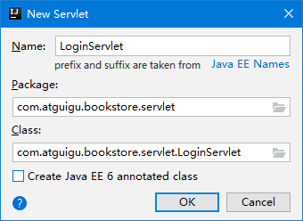
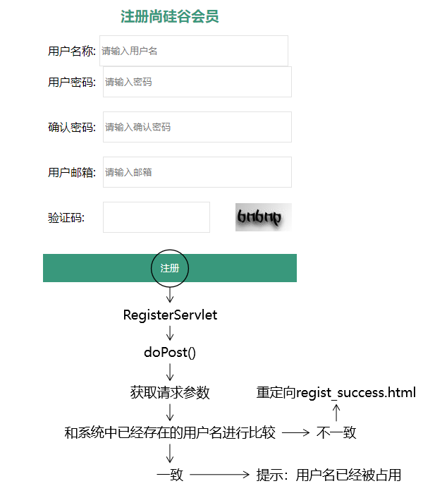
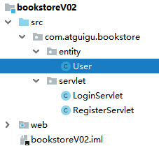
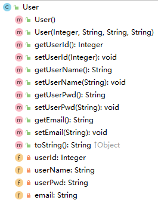
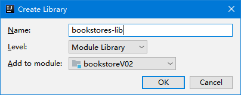
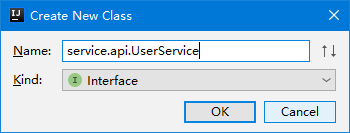
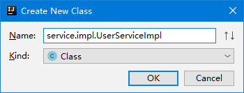
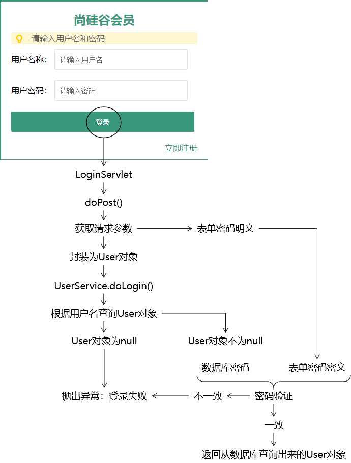

# day07 书城项目第二阶段

## 第一章 不带数据库的注册登录

### 1. 实现步骤

1. 创建动态Web工程
2. 将第一版书城的静态资源拷贝到web文件夹中
3. 统一页面的基础访问路径

4. 使用静态数据进行登录校验
5. 使用完成注册时校验用户名是否存在

### 2. 内容讲解

#### 2.1 创建动态Web工程


#### 2.2 拷贝静态资源


#### 2.3 在HTML中使用base标签统一页面基础访问路径

##### 2.3.1 为什么要使用base标签统一页面基础访问路径

因为在页面中有很多的a标签、表单以及Ajax请求(以后会学)都需要写访问路径，而在访问路径中**项目路径**是一样的，所以如果不统一编写**项目路径**的话，就会发生当项目路径发生改变的时候该页面所有用到项目路径的地方都需要更改的情况


##### 2.3.2 base标签的语法规则

- base标签要写在head标签内
- base标签必须写在所有其他有路径的标签的前面
- base标签使用href属性设置路径的基准
- base标签生效的机制是：最终的访问地址=base标签href属性设置的基准+具体标签内的路径
- 如果某个路径想要基于base中的路径进行路径编写，那么它不能以`/`开头

##### 2.3.3 base标签使用举例

```html
<head>
    <meta charset="UTF-8"/>
    <meta name="viewport" content="width=device-width, initial-scale=1.0"/>
    <title>书城首页</title>
    <base href="/bookstore/"/>
    <link rel="stylesheet" href="static/css/minireset.css"/>
    <link rel="stylesheet" href="static/css/common.css"/>
    <link rel="stylesheet" href="static/css/iconfont.css"/>
    <link rel="stylesheet" href="static/css/index.css"/>
    <link rel="stylesheet" href="static/css/swiper.min.css"/>
</head>
```

##### 2.3.4 基于base标签调整整个页面的路径

在需要进行基础路径统一的页面做如下修改

###### 2.3.4.1 base标签的代码

```html
<base href="/bookstore/"/>
```

###### 2.3.4.2 对需要统一调整的路径执行替换

Ctrl+r调出替换操作窗口，并做如下替换


#### 2.4 使用静态数据实现登录校验

##### 2.4.1 假定静态数据

为了实现『不带数据库』的登录注册，我们需要假设：系统中目前已有用户：

| 用户名 | 密码   |
| ------ | ------ |
| tom    | 123456 |

##### 2.4.2 目标

在服务器端检查用户通过表单提交的用户名、密码是否正确。

- 成功：跳转到login_success.html页面
- 失败：返回错误消息

##### 2.4.3 思路


* 客户端发送请求，携带用户名和密码
* LoginServlet在doPost()方法中接收处理请求，判断客户端传入的账号密码和系统中现存的账号密码是否一致
  * 如果一致，则重定向跳转到login_success.html页面
  * 如果不一致，则通过response响应错误提示信息

##### 2.4.4 代码实现

###### 2.4.4.1 创建LoginServlet



> 创建Packages时的规范：
>
> 公司或组织域名倒序.项目名.模块名.具体包名
>
> 或
>
> 公司或组织域名倒序.项目名.具体包名

下面是完整的Servlet配置信息：

```xml
<servlet>
    <servlet-name>LoginServlet</servlet-name>
    <servlet-class>com.atguigu.bookstore.servlet.LoginServlet</servlet-class>
</servlet>
<servlet-mapping>
    <servlet-name>LoginServlet</servlet-name>
    <url-pattern>/login</url-pattern>
</servlet-mapping>
```

###### 2.4.4.2 重写doGet方法

```java
package com.atguigu.servlet;

import javax.servlet.ServletException;
import javax.servlet.http.HttpServlet;
import javax.servlet.http.HttpServletRequest;
import javax.servlet.http.HttpServletResponse;
import java.io.IOException;

/**
 * @author Leevi
 * 日期2021-05-12  09:19
 */
public class LoginServlet extends HttpServlet {
    @Override
    protected void doPost(HttpServletRequest request, HttpServletResponse response) throws ServletException, IOException {
        doGet(request, response);
    }

    @Override
    protected void doGet(HttpServletRequest request, HttpServletResponse response) throws ServletException, IOException {
        request.setCharacterEncoding("UTF-8");
        response.setContentType("text/html;charset=UTF-8");
        //1. 获取客户端传入的请求参数
        String username = request.getParameter("username");
        String password = request.getParameter("password");

        //2. 校验用户名和密码是否正确: 先不连接数据库，使用静态数据进行校验
        if ("tom".equals(username) && "123456".equals(password)) {
            //登录成功
            //跳转到login_success.html页面
            //重定向
            response.sendRedirect(request.getContextPath()+"/pages/user/login_success.html");
        }else {
            //登录失败
            //则向客户端响应登录失败的信息
            response.getWriter().write("用户名或密码错误,登录失败!!!");

            //优化方式一: 跳转回到登录页面
            //response.sendRedirect(request.getContextPath()+"/pages/user/login.html");

            //优化方式二: 向浏览器响应超文本，在超文本中提示登录失败
            //直接通过response响应整个login.html页面的内容
            //response.getWriter().write("");
        }
    }
}
```

###### 2.4.4.3 HTML页面设置表单提交地址

```html
<form id="loginForm" action="login" method="post">
	<label>用户名称：</label>
	<input class="itxt" type="text" v-model:value="username" placeholder="请输入用户名" autocomplete="off" tabindex="1" name="username" id="username" />
	<br />
	<br />
	<label>用户密码：</label>
	<input class="itxt" type="password" v-model:value="password" placeholder="请输入密码" autocomplete="off" tabindex="1" name="password" id="password" />
	<br />
	<br />
	<button type="submit" id="sub_btn" @click="loginCheck">登录</button>
</form>
```

###### 2.4.4.4 提示消息改进探索(仅供参考，实际开发不会这样做)

```java
// 5.登录失败
// 返回提示消息方案一：过于简陋
// response.setContentType("text/html;charset=UTF-8");
// response.getWriter().write("抱歉！用户名或密码不正确，请重新输入！");

// 返回提示消息方案二：没有提示消息，让用户非常困惑
// request.getRequestDispatcher("/pages/user/login.html").forward(request, response);

// 返回提示消息方案三：确实能在登录页面显示提示消息，但是实现的方式让我想骂人
response.setContentType("text/html;charset=UTF-8");
PrintWriter writer = response.getWriter();
writer.write("<!DOCTYPE html>");
writer.write("<html>");
writer.write("	<head>");
writer.write("		<base href='/bookstore/' />");
```

#### 2.5 使用静态数据校验注册时候的用户名

##### 2.5.1 目标

用户提交注册表单后，检查用户名是否被占用

- 没有被占用：注册成功
- 已经被占用：注册失败

##### 2.5.2 思路



##### 2.5.3 代码实现

###### 2.5.3.1 创建RegisterServlet


完整配置信息：

```xml
<servlet>
    <servlet-name>RegisterServlet</servlet-name>
    <servlet-class>com.atguigu.bookstore.servlet.RegisterServlet</servlet-class>
</servlet>
<servlet-mapping>
    <servlet-name>RegisterServlet</servlet-name>
    <url-pattern>/register</url-pattern>
</servlet-mapping>
```

###### 2.5.3.2 重写doPost()方法

```java
package com.atguigu.servlet;

import javax.servlet.ServletException;
import javax.servlet.http.HttpServlet;
import javax.servlet.http.HttpServletRequest;
import javax.servlet.http.HttpServletResponse;
import java.io.IOException;

/**
 * @author Leevi
 * 日期2021-05-12  09:59
 */
public class RegisterServlet extends HttpServlet {
    @Override
    protected void doPost(HttpServletRequest request, HttpServletResponse response) throws ServletException, IOException {
        doGet(request, response);
    }

    @Override
    protected void doGet(HttpServletRequest request, HttpServletResponse response) throws ServletException, IOException {
        request.setCharacterEncoding("UTF-8");
        response.setContentType("text/html;charset=UTF-8");
        //目前使用静态数据完成的只是: 校验用户名是否已存在
        //1. 获取请求参数: username
        String username = request.getParameter("username");
        //2. 校验username是否已经被占用了, 假设服务器中有一个用户:jerry
        if ("jerry".equals(username)) {
            //用户名以经被占用了,注册失败
            response.getWriter().write("用户名已被占用，请重新注册!!!");
        }else {
            //注册成功
            //跳转到注册成功页面
            response.sendRedirect(request.getContextPath()+"/pages/user/regist_success.html");
        }
    }
}
```

###### 2.5.3.3 HTML页面调整表单中的设置

```html
<form id="registerForm" action="register" method="post">
	<div class="form-item">
		<div>
			<label>用户名称:</label>
			<input v-model:value="username" type="text" name="username" placeholder="请输入用户名" />
			<span></span>
		</div>
		<span>{{usernameCheckMessage}}</span>
	</div>
	<div class="form-item">
		<div>
			<label>用户密码:</label>
			<input v-model:value="password" type="password" name="password" placeholder="请输入密码" />
		</div>
		<span class="errMess">密码的长度至少为8位</span>
	</div>
	<div class="form-item">
		<div>
			<label>确认密码:</label>
			<input v-model:value="passwordConfirm" type="password" placeholder="请输入确认密码" />
		</div>
		<span class="errMess">密码两次输入不一致</span>
	</div>
	<div class="form-item">
		<div>
			<label>用户邮箱:</label>
			<input v-model:value="email" type="text" name="email" placeholder="请输入邮箱" />
		</div>
		<span class="errMess">请输入正确的邮箱格式</span>
	</div>
	<div class="form-item">
		<div>
			<label>验证码:</label>
			<div class="verify">
				<input v-model:value="code" type="text" name="code" placeholder="" />
				
			</div>
		</div>
		<span class="errMess">请输入正确的验证码</span>
	</div>
	<button type="submit" @click="registerCheck" class="btn">注册</button>
</form>
```

## 第二章 完成带数据库的注册登录

### 1. 学习目标

* 了解三层架构
* 了解MD5加密
* 完成带数据库的登录校验
* 完成带数据库的注册功能

### 2. 内容讲解

#### 2.1 三层架构

##### 2.1.1 为什么要使用三层架构

如果不做三层架构形式的拆分：


所有和当前业务功能需求相关的代码全部耦合在一起，如果其中有任何一个部分出现了问题，牵一发而动全身，导致其他无关代码也要进行相应的修改。这样的话代码会非常难以维护。

所以为了提高开发效率，需要对代码进行模块化的拆分。整个项目模块化、组件化程度越高，越容易管理和维护，出现问题更容易排查。

##### 2.1.2 三层架构的划分


- 表述层：又可以称之为控制层，负责处理浏览器请求、返回响应、页面调度
- 业务逻辑层：负责处理业务逻辑，根据业务逻辑把持久化层从数据库查询出来的数据进行运算、组装，封装好后返回给表述层，也可以根据业务功能的需要调用持久化层把数据保存到数据库、修改数据库中的数据、删除数据库中的数据
- 持久化层：根据上一层的调用对数据库中的数据执行增删改查的操作

##### 2.1.3 三层架构和数据模型的关系


模型对整个项目中三层架构的每一层都提供支持，具体体现是使用模型对象<span style="color:blue;font-weight:bold;">封装业务功能数据</span>

其实数据模型就是我们之前学习的JavaBean，也是Java实体类，当然他还有很多其他的名称:

- POJO：Plain old Java Object，传统的普通的Java对象
- entity：实体类
- bean或Java bean
- domain：领域模型

#### 2.2 持久层

##### 2.2.1 数据建模

###### 2.2.1.1 创建数据库和表

```sql
CREATE DATABASE bookstore210323 CHARACTER SET utf8;
USE `bookstore210323`;
CREATE TABLE t_user(
    user_id INT PRIMARY KEY AUTO_INCREMENT,
    user_name CHAR(100),
    user_pwd CHAR(100),
    email CHAR(100)
);
```

###### 2.2.1.2 创建JavaBean






```java
public class User {
    private Integer userId;// user_id
    private String userName;// user_name
    private String userPwd;// user_pwd
    private String email;// email
    ……自己补充get、set、toString等方法
```

##### 2.2.2 加入所需jar包




##### 2.2.3 创建外部属性文件

在idea的工程结构中，我们通常将配置文件放在resources目录下

###### 2.2.3.1 创建资源目录


1. 在当前module中创建一个directory，并且命名为resources
2. 然后将这个目录标记为Resources Root


3. 编写jdbc.properties文件

```
driverClassName=com.mysql.jdbc.Driver
url=jdbc:mysql://localhost:3306/bookstore210107
username=root
password=123
initialSize=10
maxActive=20
maxWait=10000
```

##### 2.2.4 创建连接数据库的工具类

```java
package com.atguigu.bookstore.utils;

import com.alibaba.druid.pool.DruidDataSourceFactory;

import javax.sql.DataSource;
import java.io.InputStream;
import java.sql.Connection;
import java.sql.SQLException;
import java.util.Properties;

/**
 * 包名:com.atguigu.bookstore.utils
 *
 * @author Leevi
 * 日期2021-04-02  14:53
 */
public class JDBCUtil {
    private static DataSource dataSource;

    static {

        // 1.创建一个用于存储外部属性文件信息的Properties对象
        Properties properties = new Properties();
        // 2.使用当前类的类加载器加载外部属性文件：jdbc.properties
        InputStream inputStream = JDBCUtil.class.getClassLoader().getResourceAsStream("jdbc.properties");

        try {

            // 3.将外部属性文件jdbc.properties中的数据加载到properties对象中
            properties.load(inputStream);

            // 4.创建数据源对象
            dataSource = DruidDataSourceFactory.createDataSource(properties);

        } catch (Exception e) {
            e.printStackTrace();
        }

    }

    /**
     * 从数据源中获取数据库连接
     *
     * @return 数据库连接对象
     */
    public static Connection getConnection() {

        Connection connection = null;

        try {
            connection = dataSource.getConnection();
        } catch (SQLException e) {
            e.printStackTrace();
            throw new RuntimeException(e);
        }

        return connection;

    }

    /**
     * 释放数据库连接
     *
     * @param connection 要执行释放操作的连接对象
     */
    public static void releaseConnection(Connection connection) {

        if (connection != null) {

            try {
                connection.close();
            } catch (SQLException e) {
                e.printStackTrace();
                throw new RuntimeException(e);
            }

        }
    }
}
```

测试代码如下:

```java
public class BookstoreTest {

    @Test
    public void testConnection() {

        Connection connection = JDBCUtils.getConnection();
        System.out.println("connection = " + connection);

    }

}
```

##### 2.2.5 Dao的概念
Dao是data access Object的缩写，中文翻译为数据访问对象，我们会将操作持久层的代码编写到对应的Dao类中

##### 2.2.6 编写BaseDao类作为所有Dao类的基类(父类)


```java
package com.atguigu.dao;

import com.atguigu.utils.JDBCUtil;
import org.apache.commons.dbutils.QueryRunner;
import org.apache.commons.dbutils.handlers.BeanHandler;
import org.apache.commons.dbutils.handlers.BeanListHandler;

import java.sql.SQLException;
import java.util.List;

/**
 * 包名:com.atguigu.dao
 *
 * @author Leevi
 * 日期2021-05-12  11:00
 */
public class BaseDao<T> {
    private QueryRunner queryRunner = new QueryRunner();

    /**
     * 执行增删改的sql语句
     * @param sql
     * @param params
     * @return
     */
    public int update(String sql,Object... params){
        try {
            //执行增删改的sql语句，返回受到影响的行数
            return queryRunner.update(JDBCUtil.getConnection(),sql,params);
        } catch (SQLException e) {
            e.printStackTrace();
            throw new RuntimeException(e.getMessage());
        }
    }

    /**
     * 执行查询一行数据的sql语句，将结果集封装到JavaBean对象中
     * @param clazz
     * @param sql
     * @param params
     * @return
     */
    public T getBean(Class<T> clazz,String sql,Object... params){
        try {
            return queryRunner.query(JDBCUtil.getConnection(),sql,new BeanHandler<>(clazz),params);
        } catch (SQLException e) {
            throw new RuntimeException(e.getMessage());
        }
    }

    /**
     * 执行查询多行数据的sql语句，并且将结果集封装到List<JavaBean>
     * @param clazz
     * @param sql
     * @param params
     * @return
     */
    public List<T> getBeanList(Class<T> clazz, String sql, Object... params){
        try {
            return queryRunner.query(JDBCUtil.getConnection(),sql,new BeanListHandler<>(clazz),params);
        } catch (SQLException e) {
            throw new RuntimeException(e.getMessage());
        }
    }
}
```
测试代码如下:

```java
@Test
public void testUpdate() {
    BaseDao<Object> baseDao = new BaseDao<>();

    String sql = "insert into t_user(user_name,user_pwd) values(?,?)";

    int count = baseDao.update(sql, "罗志祥", "789456");

    System.out.println("count = " + count);
}

@Test
public void testGetBean() {
    BaseDao<User> baseDao = new BaseDao<>();

    // user_id userId
    // user_name userName
    // user_pwd userPwd
    String sql = "select user_id userId,user_name userName,user_pwd userPwd from t_user where user_id=?";

    User user = baseDao.getBean(User.class, sql, 2);

    System.out.println("user = " + user);
}

@Test
public void testGetBeanList() {
    BaseDao<User> baseDao = new BaseDao<>();

    String sql = "select user_id userId,user_name userName,user_pwd userPwd from t_user";

    List<User> userList = baseDao.getBeanList(User.class, sql);

    for (User user : userList) {
        System.out.println("user = " + user);
    }
}
```

##### 2.2.7 创建UserDao

###### 2.2.7.1 用户登录注册功能中的组件关系图


###### 2.2.7.2 创建UserDao接口


```java
package com.atguigu.dao;

import com.atguigu.bean.User;

import java.sql.SQLException;

/**
 * 包名:com.atguigu.dao
 *
 * @author Leevi
 * 日期2021-05-12  11:20
 */
public interface UserDao {

    /**
     * 根据用户名查找用户
     * @param username
     * @return
     * @throws SQLException
     */
    User findByUsername(String username) throws SQLException;

    /**
     * 往t_user表中添加用户信息
     * @param user
     */
    void addUser(User user) throws SQLException;
}
```

###### 2.2.7.3 创建UserDaoImpl实现类

```java
package com.atguigu.dao.impl;

import com.atguigu.bean.User;
import com.atguigu.dao.BaseDao;
import com.atguigu.dao.UserDao;

import java.sql.SQLException;

/**
 * 包名:com.atguigu.dao
 * @author Leevi
 * 日期2021-05-12  10:47
 * 用户模块的持久层类
 *
 * 接口的作用是可以进行模块之间的解耦
 */
public class UserDaoImpl extends BaseDao<User> implements UserDao{
    @Override
    public User findByUsername(String username) throws SQLException{
        String sql = "select user_id userId,user_name username,user_pwd userPwd,email from t_user where user_name=?";
        return getBean(User.class,sql,username);
    }

    @Override
    public void addUser(User user) throws SQLException {
        String sql = "insert into t_user (user_name,user_pwd,email) values (?,?,?)";
        update(sql,user.getUsername(),user.getUserPwd(),user.getEmail());
    }
}
```

###### 2.2.7.4 测试代码

```java
package com.atguigu.test;

import com.atguigu.bean.User;
import com.atguigu.dao.impl.UserDaoImpl;
import org.junit.Test;

import java.sql.SQLException;

/**
 * 包名:com.atguigu.test
 *
 * @author Leevi
 * 日期2021-05-12  10:54
 */
public class TestDao {
    @Test
    public void testAddUser() throws SQLException {
        User user = new User(null, "aobama", "654321", "654321@qq.com");

        new UserDaoImpl().addUser(user);
    }
    @Test
    public void testFindUser() throws Exception {
        UserDaoImpl userDaoImpl = new UserDaoImpl();
        User user = userDaoImpl.findByUsername("jay");
        System.out.println(user);
    }
}
```

#### 2.3 加密方式介绍

##### 2.3.1 加密方式介绍

- 对称加密：加密和解密使用的相同的密钥，常见的对称加密算法有:DES、3DES
- 非对称加密：加密和解密使用的密钥不同，常见的非对称加密算法有:RSA
  - 加密：使用私钥加密
  - 解密：使用公钥解密
- 消息摘要:  消息摘要算法的主要特征是加密过程不需要密钥，并且经过加密的数据无法被解密，只有相同的原文经过消息摘要算法之后，才能得到相同的密文，所以消息摘要通常用来校验原文的真伪。常用的消息摘要算法有:MD5、SHA、MAC

我们在书城项目中采用MD5算法对密码进行加密

##### 2.3.2 封装执行加密的工具类

```java
public class MD5Util {

    /**
     * 针对明文字符串执行MD5加密
     * @param source
     * @return
     */
    public static String encode(String source) {

        // 1.判断明文字符串是否有效
        if (source == null || "".equals(source)) {
            throw new RuntimeException("用于加密的明文不可为空");
        }

        // 2.声明算法名称
        String algorithm = "md5";

        // 3.获取MessageDigest对象
        MessageDigest messageDigest = null;
        try {
            messageDigest = MessageDigest.getInstance(algorithm);
        } catch (NoSuchAlgorithmException e) {
            e.printStackTrace();
        }

        // 4.获取明文字符串对应的字节数组
        byte[] input = source.getBytes();

        // 5.执行加密
        byte[] output = messageDigest.digest(input);

        // 6.创建BigInteger对象
        int signum = 1;
        BigInteger bigInteger = new BigInteger(signum, output);

        // 7.按照16进制将bigInteger的值转换为字符串
        int radix = 16;
        String encoded = bigInteger.toString(radix).toUpperCase();

        return encoded;
    }
}
```

#### 2.4 注册功能

##### 2.4.1 目标

检查用户名是否可用，如果用户名可用则保存User对象

##### 2.4.2 思路


##### 2.4.3 代码

###### 2.4.3.1 创建UserService接口



```java
public interface UserService {
    void doRegister(User userForm);
}
```

开发中，接口设计和接口中方式定义的理念：

- 方法的返回值应该对应这个方法本身的业务功能
  - 写操作：没有返回值
  - 读操作：有返回值，返回值就是查询的结果
- 方法执行是否成功
  - 成功：不抛异常
  - 失败：抛异常


###### 2.4.3.2 创建UserServiceImpl实现类



```java
package com.atguigu.service.impl;

import com.atguigu.bean.User;
import com.atguigu.dao.UserDao;
import com.atguigu.dao.impl.UserDaoImpl;
import com.atguigu.service.UserService;
import com.atguigu.utils.MD5Util;

/**
 * 包名:com.atguigu.service.impl
 *
 * @author Leevi
 * 日期2021-05-12  11:26
 */
public class UserServiceImpl implements UserService{
    private UserDao userDao = new UserDaoImpl();
    @Override
    public void doRegister(User user) throws Exception {
        //注册之前:校验用户名是否已存在
        //调用持久层的方法，根据username查找用户，查找到了就表示已存在
        User existUser = userDao.findByUsername(user.getUsername());
        if (existUser != null) {
            //表示当前用户已存在，注册失败
            throw new RuntimeException("用户名已存在");
        }
        //需求: 注册的时候，要对用户的密码进行加密
        String oldUserPwd = user.getUserPwd();
        //将明文进行加密得到加密后的密码
        String encodedPwd = MD5Util.encode(oldUserPwd);
        //将加密后的密码设置到user中
        user.setUserPwd(encodedPwd);
        //处理注册，其实就是调用持久层的方法添加用户

        userDao.addUser(user);
    }
}
```

###### 2.4.3.3 修改RegisterServlet的代码

```java
package com.atguigu.servlet;

import com.atguigu.bean.User;
import com.atguigu.service.UserService;
import com.atguigu.service.impl.UserServiceImpl;
import org.apache.commons.beanutils.BeanUtils;

import javax.servlet.ServletException;
import javax.servlet.http.HttpServlet;
import javax.servlet.http.HttpServletRequest;
import javax.servlet.http.HttpServletResponse;
import java.io.IOException;
import java.util.Map;

/**
 * @author Leevi
 * 日期2021-05-12  09:59
 */
public class RegisterServlet extends HttpServlet {
    private UserService userService = new UserServiceImpl();
    @Override
    protected void doPost(HttpServletRequest request, HttpServletResponse response) throws ServletException, IOException {
        doGet(request, response);
    }

    @Override
    protected void doGet(HttpServletRequest request, HttpServletResponse response) throws ServletException, IOException {
        request.setCharacterEncoding("UTF-8");
        response.setContentType("text/html;charset=UTF-8");

        //1. 获取请求参数
        Map<String, String[]> parameterMap = request.getParameterMap();
        //2. 使用BeanUtils将parameterMap中的数据封装到User对象
        User user = new User();
        try {
            BeanUtils.populate(user,parameterMap);
            //3. 调用业务层的方法处理注册业务
            userService.doRegister(user);

            //没有异常，就是注册成功
            //跳转到注册成功页面
            response.sendRedirect(request.getContextPath()+"/pages/user/regist_success.html");
        } catch (Exception e) {
            e.printStackTrace();
            //有异常就注册失败
            response.getWriter().write("注册失败,"+e.getMessage());
        }
    }
}
```

#### 2.5 登录功能

##### 2.5.1 目标

* 校验用户名是否正确
* 校验密码是否正确

##### 2.5.2 思路



##### 2.5.3 代码实现

###### 2.5.3.1 UserService接口添加doLogin()方法

```java
package com.atguigu.service;

import com.atguigu.bean.User;

/**
 * 包名:com.atguigu.service
 *
 * @author Leevi
 * 日期2021-05-12  11:26
 */
public interface UserService {
    /**
     * 处理注册的业务
     * @param user
     */
    void doRegister(User user) throws Exception;

    /**
     * 处理登录的业务
     * @param parameterUser
     * @return 返回值User表示当前登录的用户的信息
     * @throws Exception
     */
    User doLogin(User parameterUser) throws Exception;
}
```

###### 2.5.3.2 UserServiceImpl类的doLogin()

```java
@Override
public User doLogin(User parameterUser) throws Exception {
    //1. 调用dao层的方法根据用户名查询用户信息
    User loginUser = userDao.findByUsername(parameterUser.getUsername());
    //2. 判断loginUser是否为空
    if (loginUser != null) {
        //说明用户名正确，那么接下来校验密码
        //parameterUser中的密码是用户输入的密码，我们对其进行MD5加密，完之后跟loginUser中的密码(数据库中的密码)进行比对
        String encodePwd = MD5Util.encode(parameterUser.getUserPwd());//加密之后的用户输入的密码
        String dbPwd = loginUser.getUserPwd();//数据库中的密码
        if (dbPwd.equals(encodePwd)) {
            //说明密码正确,登录成功，返回loginUser对象
            return loginUser;
        }else {
            //密码错误
            throw new RuntimeException("密码错误");
        }
    }
    throw new RuntimeException("用户名错误");
}
```

###### 2.5.3.2 修改LoginServlet的doPost方法

```java
protected void doPost(HttpServletRequest request, HttpServletResponse response) throws ServletException, IOException {

    // 1.从请求参数中获取用户名和密码
    String username = request.getParameter("username");
    String password = request.getParameter("password");

    // 2.封装为User对象
    User userForm = new User(null, username, password, null);

    // 3.调用UserService的方法执行登录验证
    try {
        User userDB = userService.doLogin(userForm);

        // 4.登录成功后跳转到登录成功页面
        response.sendRedirect(request.getContextPath() + "/pages/user/login_success.html");
    } catch (Exception e) {
        e.printStackTrace();

        // 5.登录失败则显示提示消息
        response.setContentType("text/html;charset=UTF-8");
        response.getWriter().write("登录失败：" + e.getMessage());
    }

}
```
