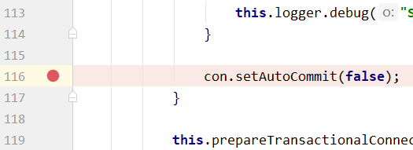
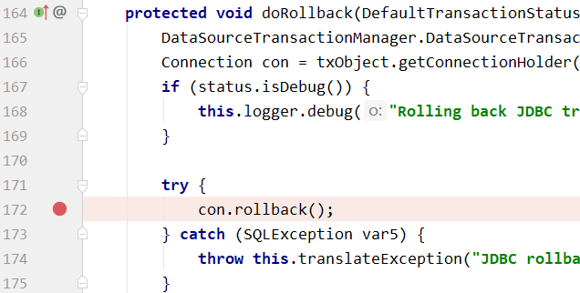

[[toc]]

# 实验二 应用最基本的事务控制

## 1、加事务前状态

### ①搞破坏

修改 EmpDao 中的 updateEmpSalaryById()方法：

```java
public void updateEmpSalaryById(Integer empId, Double salary) {

    // 为了看到操作失败后的效果人为将 SQL 语句破坏
    String sql = "upd222ate t_emp set emp_salary=? where emp_id=?";
    jdbcTemplate.update(sql, salary, empId);
}
```


### ②执行Service方法

```java
@Test
public void testBaseTransaction() {
    
    Integer empId4EditName = 2;
    String newName = "new-name";
    
    Integer empId4EditSalary = 3;
    Double newSalary = 444.44;
    
    empService.updateTwice(empId4EditName, newName, empId4EditSalary, newSalary);
    
}
```


效果：修改姓名的操作生效了，修改工资的操作没有生效。


## 2、添加事务功能

### ①配置事务管理器


```xml
<!-- 配置事务管理器 -->
<bean id="transactionManager" class="org.springframework.jdbc.datasource.DataSourceTransactionManager">
   
    <!-- 事务管理器的bean只需要装配数据源，其他属性保持默认值即可 -->
    <property name="dataSource" ref="druidDataSource"/>
</bean>
```


### ②开启基于注解的声明式事务功能


```xml
<!-- 开启基于注解的声明式事务功能 -->
<!-- 使用transaction-manager属性指定当前使用是事务管理器的bean -->
<!-- transaction-manager属性的默认值是transactionManager，如果事务管理器bean的id正好就是这个默认值，则可以省略这个属性 -->
<tx:annotation-driven transaction-manager="transactionManager"/>
```

注意：导入名称空间时有好几个重复的，我们需要的是<span style="color:blue;font-weight:bold;"> tx 结尾</span>的那个。


### ③在需要事务的方法上使用注解


```java
@Transactional
public void updateTwice(
        // 修改员工姓名的一组参数
        Integer empId4EditName, String newName,
 
        // 修改员工工资的一组参数
        Integer empId4EditSalary, Double newSalary
        ) {
 
    // 为了测试事务是否生效，执行两个数据库操作，看它们是否会在某一个失败时一起回滚
    empDao.updateEmpNameById(empId4EditName, newName);
 
    empDao.updateEmpSalaryById(empId4EditSalary, newSalary);
 
}
```


### ④测试

junit测试方法不需要修改，执行后查看数据是否被修改。


## 3、从日志内容角度查看事务效果

### ①加入依赖

```xml
<!-- 加入日志 -->
<dependency>
    <groupId>ch.qos.logback</groupId>
    <artifactId>logback-classic</artifactId>
    <version>1.2.3</version>
</dependency>
```


### ②加入logback的配置文件

文件名：logback.xml

```xml
<?xml version="1.0" encoding="UTF-8"?>
<configuration debug="true">
    <!-- 指定日志输出的位置 -->
    <appender name="STDOUT"
              class="ch.qos.logback.core.ConsoleAppender">
        <encoder>
            <!-- 日志输出的格式 -->
            <!-- 按照顺序分别是：时间、日志级别、线程名称、打印日志的类、日志主体内容、换行 -->
            <pattern>[%d{HH:mm:ss.SSS}] [%-5level] [%thread] [%logger] [%msg]%n</pattern>
        </encoder>
    </appender>
 
    <!-- 设置全局日志级别。日志级别按顺序分别是：DEBUG、INFO、WARN、ERROR -->
    <!-- 指定任何一个日志级别都只打印当前级别和后面级别的日志。 -->
    <root level="INFO">
        <!-- 指定打印日志的appender，这里通过“STDOUT”引用了前面配置的appender -->
        <appender-ref ref="STDOUT" />
    </root>
 
    <!-- 根据特殊需求指定局部日志级别 -->
    <logger name="org.springframework.jdbc.datasource.DataSourceTransactionManager" level="DEBUG"/>
    <logger name="org.springframework.jdbc.core.JdbcTemplate" level="DEBUG" />
 
</configuration>
```


### ③日志中事务相关内容

#### [1]事务回滚时

> [11:37:36.965] [DEBUG] [main] [org.springframework.jdbc.datasource.DataSourceTransactionManager] [<span style="color:blue;font-weight:bold;"> Creating new transaction</span> with name [com.atguigu.tx.service.EmpService.updateTwice]: PROPAGATION_REQUIRED,ISOLATION_DEFAULT]
> [11:37:37.328] [INFO ] [main] [com.alibaba.druid.pool.DruidDataSource] [{dataSource-1} inited]
> [11:37:37.815] [DEBUG] [main] [org.springframework.jdbc.datasource.DataSourceTransactionManager] [<span style="color:blue;font-weight:bold;"> Acquired Connection</span> [com.mysql.jdbc.JDBC4Connection@6b6776cb] for JDBC transaction]
> [11:37:37.818] [DEBUG] [main] [org.springframework.jdbc.datasource.DataSourceTransactionManager] [<span style="color:blue;font-weight:bold;"> Switching JDBC Connection</span> [com.mysql.jdbc.JDBC4Connection@6b6776cb] to <span style="color:blue;font-weight:bold;"> manual commit</span>]
>
> [11:44:32.311] [DEBUG] [main] [org.springframework.jdbc.core.JdbcTemplate] [Executing prepared SQL update]
> [11:44:32.312] [DEBUG] [main] [org.springframework.jdbc.core.JdbcTemplate] [Executing prepared SQL statement [<span style="color:blue;font-weight:bold;">update t_emp set emp_name=? where emp_id=?</span>]]
> [11:44:32.339] [DEBUG] [main] [org.springframework.jdbc.core.JdbcTemplate] [Executing prepared SQL update]
> [11:44:32.339] [DEBUG] [main] [org.springframework.jdbc.core.JdbcTemplate] [Executing prepared SQL statement [<span style="color:blue;font-weight:bold;"><span style="color:red;">upd222ate</span> t_emp set emp_salary=? where emp_id=?</span>]]
>
> [11:37:37.931] [DEBUG] [main] [org.springframework.jdbc.datasource.DataSourceTransactionManager] [<span style="color:blue;font-weight:bold;">Initiating transaction rollback</span>]
> [11:37:37.931] [DEBUG] [main] [org.springframework.jdbc.datasource.DataSourceTransactionManager] [<span style="color:blue;font-weight:bold;">Rolling back</span> JDBC transaction on Connection [com.mysql.jdbc.JDBC4Connection@6b6776cb]]
> [11:37:37.933] [DEBUG] [main] [org.springframework.jdbc.datasource.DataSourceTransactionManager] [Releasing JDBC Connection [com.mysql.jdbc.JDBC4Connection@6b6776cb] after transaction]


#### [2]事务提交时

> [11:42:40.093] [DEBUG] [main] [org.springframework.jdbc.datasource.DataSourceTransactionManager] [<span style="color:blue;font-weight:bold;">Creating new transaction</span> with name [com.atguigu.tx.service.EmpService.updateTwice]: PROPAGATION_REQUIRED,ISOLATION_DEFAULT]
> [11:42:40.252] [INFO ] [main] [com.alibaba.druid.pool.DruidDataSource] [{dataSource-1} inited]
> [11:42:40.655] [DEBUG] [main] [org.springframework.jdbc.datasource.DataSourceTransactionManager] [<span style="color:blue;font-weight:bold;">Acquired Connection</span> [com.mysql.jdbc.JDBC4Connection@6b6776cb] for JDBC transaction]
> [11:42:40.661] [DEBUG] [main] [org.springframework.jdbc.datasource.DataSourceTransactionManager] [<span style="color:blue;font-weight:bold;">Switching JDBC Connection</span> [com.mysql.jdbc.JDBC4Connection@6b6776cb] to <span style="color:blue;font-weight:bold;">manual commit</span>]
> [11:42:40.681] [DEBUG] [main] [org.springframework.jdbc.core.JdbcTemplate] [Executing prepared SQL update]
> [11:42:40.682] [DEBUG] [main] [org.springframework.jdbc.core.JdbcTemplate] [Executing prepared SQL statement [<span style="color:blue;font-weight:bold;">update t_emp set emp_name=? where emp_id=?</span>]]
> [11:42:40.710] [DEBUG] [main] [org.springframework.jdbc.core.JdbcTemplate] [Executing prepared SQL update]
> [11:42:40.711] [DEBUG] [main] [org.springframework.jdbc.core.JdbcTemplate] [Executing prepared SQL statement [<span style="color:blue;font-weight:bold;">update t_emp set emp_salary=? where emp_id=?</span>]]
> [11:42:40.712] [DEBUG] [main] [org.springframework.jdbc.datasource.DataSourceTransactionManager] [<span style="color:blue;font-weight:bold;">Initiating transaction commit</span>]
> [11:42:40.712] [DEBUG] [main] [org.springframework.jdbc.datasource.DataSourceTransactionManager] [<span style="color:blue;font-weight:bold;">Committing JDBC transaction</span> on Connection [com.mysql.jdbc.JDBC4Connection@6b6776cb]]
> [11:42:40.714] [DEBUG] [main] [org.springframework.jdbc.datasource.DataSourceTransactionManager] [<span style="color:blue;font-weight:bold;">Releasing JDBC Connection</span> [com.mysql.jdbc.JDBC4Connection@6b6776cb] after transaction]


## 4、debug查看事务管理器中的关键方法

类：org.springframework.jdbc.datasource.DataSourceTransactionManager


### ①开启事务的方法





### ②提交事务的方法


### ③回滚事务的方法




[上一个实验](experiment01.html) [回目录](../verse03.html) [下一个实验](experiment03.html)