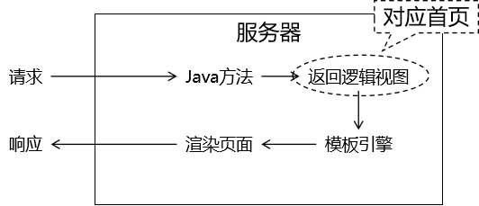
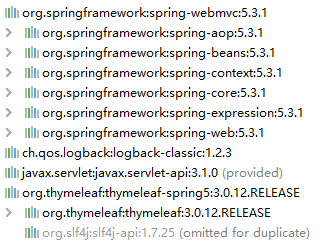

[[toc]]

# 第二节 HelloWorld

## 1、功能需求

### ①访问首页




### ②在首页点超链接


## 2、搭建环境

### ①导入依赖

```xml
<dependencies>
    <!-- SpringMVC -->
    <dependency>
        <groupId>org.springframework</groupId>
        <artifactId>spring-webmvc</artifactId>
        <version>5.3.1</version>
    </dependency>
    
    <!-- 日志 -->
    <dependency>
        <groupId>ch.qos.logback</groupId>
        <artifactId>logback-classic</artifactId>
        <version>1.2.3</version>
    </dependency>
    
    <!-- ServletAPI -->
    <dependency>
        <groupId>javax.servlet</groupId>
        <artifactId>javax.servlet-api</artifactId>
        <version>3.1.0</version>
        <scope>provided</scope>
    </dependency>
    
    <!-- Spring5和Thymeleaf整合包 -->
    <dependency>
        <groupId>org.thymeleaf</groupId>
        <artifactId>thymeleaf-spring5</artifactId>
        <version>3.0.12.RELEASE</version>
    </dependency>
</dependencies>
```


由于 Maven 的传递性，我们不必将所有需要的包全部配置依赖，而是配置最顶端的依赖，其他靠传递性导入。




### ②日志配置文件

```xml
<?xml version="1.0" encoding="UTF-8"?>
<configuration debug="true">
    <!-- 指定日志输出的位置 -->
    <appender name="STDOUT"
              class="ch.qos.logback.core.ConsoleAppender">
        <encoder>
            <!-- 日志输出的格式 -->
            <!-- 按照顺序分别是：时间、日志级别、线程名称、打印日志的类、日志主体内容、换行 -->
            <pattern>[%d{HH:mm:ss.SSS}] [%-5level] [%thread] [%logger] [%msg]%n</pattern>
        <charset>UTF-8</charset>
        </encoder>
    </appender>
    
    <!-- 设置全局日志级别。日志级别按顺序分别是：DEBUG、INFO、WARN、ERROR -->
    <!-- 指定任何一个日志级别都只打印当前级别和后面级别的日志。 -->
    <root level="INFO">
        <!-- 指定打印日志的appender，这里通过“STDOUT”引用了前面配置的appender -->
        <appender-ref ref="STDOUT" />
    </root>
    
    <!-- 根据特殊需求指定局部日志级别 -->
    <logger name="org.springframework.web.servlet.DispatcherServlet" level="DEBUG" />
    
</configuration>
```


### ③web.xml

```xml
<!-- 配置SpringMVC中负责处理请求的核心Servlet，也被称为SpringMVC的前端控制器 -->
<servlet>
    <servlet-name>DispatcherServlet</servlet-name>
    
    <!-- DispatcherServlet的全类名 -->
    <servlet-class>org.springframework.web.servlet.DispatcherServlet</servlet-class>
    
    <!-- 通过初始化参数指定SpringMVC配置文件位置 -->
    <init-param>
    
        <!-- 如果不记得contextConfigLocation配置项的名称，可以到DispatcherServlet的父类FrameworkServlet中查找 -->
        <param-name>contextConfigLocation</param-name>
    
        <!-- 使用classpath:说明这个路径从类路径的根目录开始才查找 -->
        <param-value>classpath:spring-mvc.xml</param-value>
    </init-param>
    
    <!-- 作为框架的核心组件，在启动过程中有大量的初始化操作要做，这些操作放在第一次请求时才执行非常不恰当 -->
    <!-- 我们应该将DispatcherServlet设置为随Web应用一起启动 -->
    <load-on-startup>1</load-on-startup>
    
</servlet>
    
<servlet-mapping>
    <servlet-name>DispatcherServlet</servlet-name>
    
    <!-- 对DispatcherServlet来说，url-pattern有两种方式配置 -->
    <!-- 方式一：配置“/”，表示匹配整个Web应用范围内所有请求。这里有一个硬性规定：不能写成“/*”。只有这一个地方有这个特殊要求，以后我们再配置Filter还是可以正常写“/*”。 -->
    <!-- 方式二：配置“*.扩展名”，表示匹配整个Web应用范围内部分请求 -->
    <url-pattern>/</url-pattern>
</servlet-mapping>
```


### ④Spring配置文件

```xml
<!-- 自动扫描包 -->
<context:component-scan base-package="com.atguigu.mvc.handler"/>
    
<!-- Thymeleaf视图解析器 -->
<bean id="viewResolver" class="org.thymeleaf.spring5.view.ThymeleafViewResolver">
    <property name="order" value="1"/>
    <property name="characterEncoding" value="UTF-8"/>
    <property name="templateEngine">
        <bean class="org.thymeleaf.spring5.SpringTemplateEngine">
            <property name="templateResolver">
                <bean class="org.thymeleaf.spring5.templateresolver.SpringResourceTemplateResolver">
    
                    <!-- 视图前缀 -->
                    <property name="prefix" value="/WEB-INF/templates/"/>
    
                    <!-- 视图后缀 -->
                    <property name="suffix" value=".html"/>
                    <property name="templateMode" value="HTML5"/>
                    <property name="characterEncoding" value="UTF-8" />
                </bean>
            </property>
        </bean>
    </property>
</bean>
```


## 3、代码实现

### ①创建请求处理器类

#### [1]名称

SpringMVC 对处理请求的类并没有特殊要求，只要是 POJO 即可。我们自己习惯上有两种命名方式：

- XxxHandler：意思是 Xxx 处理器的意思
- XxxController：意思是 Xxx 控制器的意思

这只是一个命名的习惯，不是语法要求。所以往往把处理请求的类叫做『Handler类』，处理请求的方法叫做『Handler方法』。


#### [2]创建


```java
@Controller
public class Demo01HelloHandler {
    
    
    
}
```


### ②实现访问首页

#### [1]创建 handler 方法

```java
@Controller
public class Demo01HelloHandler {

    // @RequestMapping注解在请求地址和Java方法之间建立映射关系
    @RequestMapping("/")
    public String showPortal() {
        return "portal";
    }

}
```


#### [2]在首页编写超链接


```html
<!DOCTYPE html>
<html lang="en" xmlns:th="http://www.thymeleaf.org">
<head>
    <meta charset="UTF-8">
    <title>首页</title>
</head>
<body>
    
    <h1>首页</h1>
    
    <!-- 以后我们会越来越倾向于用一句话来作为请求的URL地址，在这样的一句话中使用“/”分隔各个单词 -->
    <!-- say hello to spring mvc -->
    <!-- /say/hello/to/spring/mvc -->
    <a th:href="@{/say/hello/to/spring/mvc}">HelloWorld</a><br/>
    
</body>
</html>
```


### ③实现点击超链接

#### [1]加入日志记录仪

在 handler 类中声明一个成员变量：

```java
private Logger logger = LoggerFactory.getLogger(this.getClass());
```

- Logger：org.slf4j.Logger
- LoggerFactory：org.slf4j.LoggerFactory


使用日志而不是 sysout 的方式在控制台打印，好处在于：根据日志的级别可以非常方便的控制某些日志是否打印。

不管 sysout 还是日志，只要是在控制台打印数据，底层都是 I/O 操作。在项目中，访问数据库和 I/O 都是典型的高消耗型的操作。

在控制台打印的数据，用户看不到，打印它肯定是为了调试程序等类似需求。所以在项目上线的时候，用于调试程序的控制台打印都应该去掉。

如果我们是通过 sysout 方式打印，那么它们会分散在项目中的各个地方，想要通过手动方式删除会很繁琐也可能会有遗漏。

而使用日志的方式，只要在配置文件中修改一下日志级别，就能全面控制某个级别的日志打印或者不打印。

而且日志框架通常都能够指定日志保存的位置，如果有需要可以将日志数据保存到数据库等位置。


#### [2]声明 handler 方法

```java
// 以后我们会越来越倾向于用一句话来作为请求的URL地址
// 在这样的一句话中使用“/”分隔各个单词
@RequestMapping("/say/hello/to/spring/mvc")
public String sayHello() {
    
    // 方法内部打印日志，证明 SpringMVC 确实调用了这个方法来处理请求
    logger.debug("我是 SpringMVC 的 Hello world。");
    
    return "target";
}
```


#### [3]创建目标页面


```html
<!DOCTYPE html>
<html lang="en" xmlns:th="http://www.thymeleaf.org">
<head>
    <meta charset="UTF-8">
    <title>目标页面</title>
</head>
<body>
    
    <h1>目标页面</h1>
    
    <a th:href="@{/}">回首页</a>
    
</body>
</html>
```


### ④整体流程解析


[上一节](verse01.html) [回目录](index.html) [下一节](verse03.html)