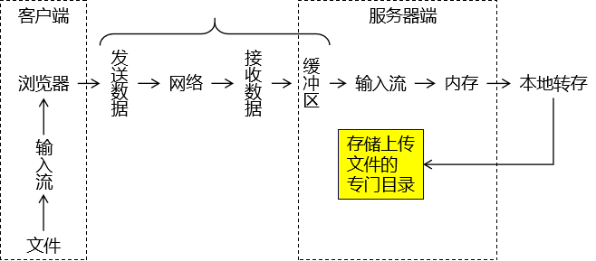
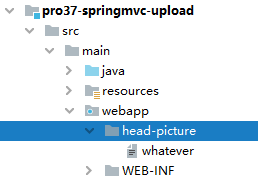

[[toc]]

# 第六节 文件上传

## 1、表单

- 第一点：请求方式必须是 POST
- 第二点：请求体的编码方式必须是 multipart/form-data（通过 form 标签的 enctype 属性设置）
- 第三点：使用 input 标签、type 属性设置为 file 来生成文件上传框


## 2、SpringMVC 环境要求

### ①依赖

```xml
<!-- https://mvnrepository.com/artifact/commons-fileupload/commons-fileupload -->
<dependency>
    <groupId>commons-fileupload</groupId>
    <artifactId>commons-fileupload</artifactId>
    <version>1.3.1</version>
</dependency>
```


### ②配置

在 SpringMVC 的配置文件中加入 multipart 类型数据的解析器：

```xml
<bean id="multipartResolver" 
      class="org.springframework.web.multipart.commons.CommonsMultipartResolver">
    
    <!-- 由于上传文件的表单请求体编码方式是 multipart/form-data 格式，所以要在解析器中指定字符集 -->
    <property name="defaultEncoding" value="UTF-8"/>
    
</bean>
```


## 3、handler 方法接收数据

```java
@RequestMapping("/simple/upload")
public String doUpload(
 
        // 表单提交的数据仍然是请求参数，所以使用 @RequestParam 注解接收
        @RequestParam("nickName") String nickName,
 
        // 对于上传的文件使用 MultipartFile 类型接收其相关数据
        @RequestParam("picture") MultipartFile picture
        ) throws IOException {
 
    String inputName = picture.getName();
    logger.debug("文件上传表单项的 name 属性值：" + inputName);
 
    // 获取这个数据通常都是为了获取文件本身的扩展名
    String originalFilename = picture.getOriginalFilename();
    logger.debug("文件在用户本地原始的文件名：" + originalFilename);
 
    String contentType = picture.getContentType();
    logger.debug("文件的内容类型：" + contentType);
 
    boolean empty = picture.isEmpty();
    logger.debug("文件是否为空：" + empty);
 
    long size = picture.getSize();
    logger.debug("文件大小：" + size);
 
    byte[] bytes = picture.getBytes();
    logger.debug("文件二进制数据的字节数组：" + Arrays.asList(bytes));
 
    InputStream inputStream = picture.getInputStream();
    logger.debug("读取文件数据的输入流对象：" + inputStream);
 
    Resource resource = picture.getResource();
    logger.debug("代表当前 MultiPartFile 对象的资源对象" + resource);
 
    return "target";
}
```


## 4、MultipartFile 接口


## 5、上传多个文件

### ①请求参数名不同

#### [1]表单

```html
<form th:action="@{/save/head/picture}" method="post" enctype="multipart/form-data">
    昵称：<input type="text" name="nickName" value="龙猫" /><br/>
    头像：<input type="file" name="headPicture" /><br/>
    背景：<input type="file" name="backgroundPicture" /><br/>
    <button type="submit">保存</button>
</form>
```


#### [2]handler 方法

```java
@RequestMapping("/save/head/picture")
public String saveHeadPicture(
        @RequestParam("nickName") String nickName,

        // MultipartFile 是专门接收上传文件的类型
        // 浏览器端的表单用一个名字携带一个文件：使用单个 MultipartFile 类型变量接收
        @RequestParam("headPicture") MultipartFile headPicture,

        // 如果有另外一个名字携带了另外一个文件，那就用另外一个 MultipartFile 接收
        @RequestParam("backgroundPicture") MultipartFile backgroundPicture
        ) throws IOException {

    logger.debug("[普通表单项] nickName = " + nickName);
    logger.debug("[文件表单项] 请求参数名 = " + headPicture.getName());
    logger.debug("[文件表单项] 原始文件名 = " + headPicture.getOriginalFilename());
    logger.debug("[文件表单项] 判断当前上传文件是否为空 = " + (headPicture.isEmpty()?"空":"非空"));
    logger.debug("[文件表单项] 当前上传文件的大小 = " + headPicture.getSize());
    logger.debug("[文件表单项] 当前上传文件的二进制内容组成的字节数组 = " + headPicture.getBytes());
    logger.debug("[文件表单项] 能够读取当前上传文件的输入流 = " + headPicture.getInputStream());

    logger.debug("[另一个文件] 原始文件名 = " + backgroundPicture.getOriginalFilename());
    return "target";
}
```


### ②请求参数名相同

#### [1]表单

```html
<form th:action="@{/save/multi/file}" method="post" enctype="multipart/form-data">
    文件一：<input type="file" name="fileList" /><br/>
    文件二：<input type="file" name="fileList" /><br/>
    文件三：<input type="file" name="fileList" /><br/>
    <button type="submit">保存</button>
</form>
```


#### [2]handler 方法

```java
@RequestMapping("/save/multi/file")
public String saveMultiFile(
    
        // 浏览器端的表单用一个名字携带多个文件：使用 List<MultipartFile> 类型变量接收
        @RequestParam("fileList") List<MultipartFile> fileList) {

    for (MultipartFile multipartFile : fileList) {
        String originalFilename = multipartFile.getOriginalFilename();
        logger.debug("originalFilename = " + originalFilename);
    }

    return "target";
}
```


## 6、文件转存

### ①底层机制


### ②三种去向

#### [1]本地转存



##### (1)实现方式

###### <1>创建保存文件的目录



这个目录如果是空目录，那么服务器部署运行时很容易会忽略这个目录。为了避免这个问题，在这个目录下随便创建一个文件，随便写点内容即可。


###### <2>编写转存代码

下面是负责处理文件上传请求的 handler 方法的转存部分：

```java
……
 
// 1、准备好保存文件的目标目录
// ①File 对象要求目标路径是一个物理路径（在硬盘空间里能够直接找到文件的路径）
// ②项目在不同系统平台上运行，要求能够自动兼容、适配不同系统平台的路径格式
//      例如：Window系统平台的路径是 D:/aaa/bbb 格式
//      例如：Linux系统平台的路径是 /ttt/uuu/vvv 格式
//      所以我们需要根据『不会变的虚拟路径』作为基准动态获取『跨平台的物理路径』
// ③虚拟路径：浏览器通过 Tomcat 服务器访问 Web 应用中的资源时使用的路径
String destFileFolderVirtualPath = "/head-picture";
 
// ④调用 ServletContext 对象的方法将虚拟路径转换为真实物理路径
String destFileFolderRealPath = servletContext.getRealPath(destFileFolderVirtualPath);
 
// 2、生成保存文件的文件名
// ①为了避免同名的文件覆盖已有文件，不使用 originalFilename，所以需要我们生成文件名
// ②我们生成文件名包含两部分：文件名本身和扩展名
// ③声明变量生成文件名本身
String generatedFileName = UUID.randomUUID().toString().replace("-","");
 
// ④根据 originalFilename 获取文件的扩展名
String fileExtname = originalFilename.substring(originalFilename.lastIndexOf("."));
 
// ⑤拼装起来就是我们生成的整体文件名
String destFileName = generatedFileName + "" + fileExtname;
 
// 3、拼接保存文件的路径，由两部分组成
//      第一部分：文件所在目录
//      第二部分：文件名
String destFilePath = destFileFolderRealPath + "/" + destFileName;
 
// 4、创建 File 对象，对应文件具体保存的位置
File destFile = new File(destFilePath);
 
// 5、执行转存
picture.transferTo(destFile);
 
……
```


##### (2)缺陷

- Web 应用重新部署时通常都会清理旧的构建结果，此时用户以前上传的文件会被删除，导致数据丢失。
- 项目运行很长时间后，会导致上传的文件积累非常多，体积非常大，从而拖慢 Tomcat 运行速度。
- 当服务器以集群模式运行时，文件上传到集群中的某一个实例，其他实例中没有这个文件，就会造成数据不一致。
- 不支持动态扩容，一旦系统增加了新的硬盘或新的服务器实例，那么上传、下载时使用的路径都需要跟着变化，导致 Java 代码需要重新编写、重新编译，进而导致整个项目重新部署。


#### [2]文件服务器（采纳）

##### (1)总体机制


##### (2)好处

- 不受 Web 应用重新部署影响
- 在应用服务器集群环境下不会导致数据不一致
- 针对文件读写进行专门的优化，性能有保障
- 能够实现动态扩容


##### (3)文件服务器类型

- 第三方平台：
  - 阿里的 OSS 对象存储服务
  - 七牛云
- 自己搭建服务器：FastDFS 等


#### [3]上传到其他模块

这种情况肯定出现在分布式架构中，常规业务功能不会这么做，采用这个方案的一定是特殊情况。


在 MultipartFile 接口中有一个对应的方法：

```java
/**
 * Return a Resource representation of this MultipartFile. This can be used
 * as input to the {@code RestTemplate} or the {@code WebClient} to expose
 * content length and the filename along with the InputStream.
 * @return this MultipartFile adapted to the Resource contract
 * @since 5.1
 */
default Resource getResource() {
	return new MultipartFileResource(this);
}
```

注释中说：这个 Resource 对象代表当前 MultipartFile 对象，输入给 RestTemplate 或 WebClient。而 RestTemplate 或 WebClient 就是用来在 Java 程序中向服务器端发出请求的组件。


[上一节](verse05.html) [回目录](index.html) [下一节](verse07.html)