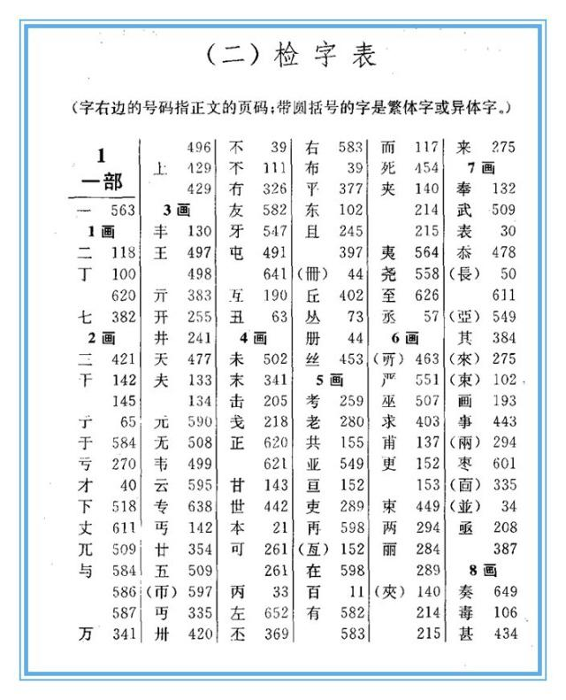
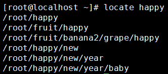
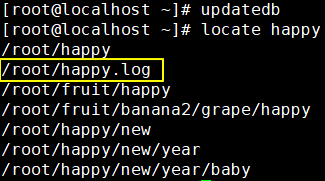

[[toc]]

# 第二节 文件和目录相关命令：locate

## 1、简介

locate命令同样是用来查询文件或目录，但它是基于索引查询，速度快很多。那什么是索引呢？

## 2、索引

建立索引可以极大提升查询的速度。为什么会有这么显著的效果呢？我们拿查字典来举个例子。

- 没有索引：从正文第一页开始翻，在每一页中检查有没有自己要找的字。在最差的情况下需要逐页翻到字典的最后一页，这样做速度非常慢。
- 基于索引：字典正文前的检字表就是正文内容的索引。先从检字表里快速找到那个字，这里没有这个字的详细信息，只有这个字所在的页码。我们根据这个页码就可以直接到正文中直接翻到那一页，这样速度就非常快了。

另一个例子是我们想要到一幢大楼里找某一个房间，肯定是先在一楼看看楼层介绍信息，找到房间号直接去。肯定不能一个房间一个房间找。

## 3、locate命令的原理

系统启动时把每一个目录、每一个文件的完整路径保存到索引库中。使用locate命令搜索关键词时，就使用关键词查询索引库，把匹配的路径字符串返回。

而新建的文件或目录不会被系统吧路径存入索引库，那么使用locate命令就搜索不到。此时使用updatedb命令更新一下索引库就行了。

## 4、操作演示

### ①使用locate命令

### ②新建文件后再搜索

搜不到

### ③更新索引库后再搜索

搜到了

[上一条](verse02-14-find.html) [回目录](verse02-00-index.html) [下一条](verse02-16-grep.html)