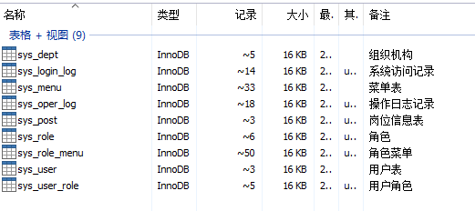
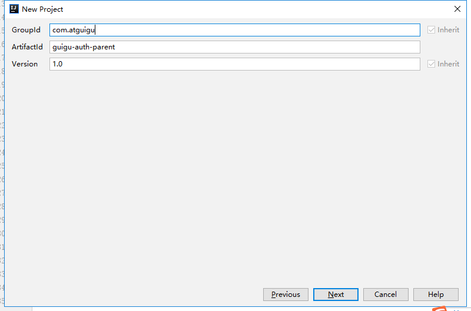
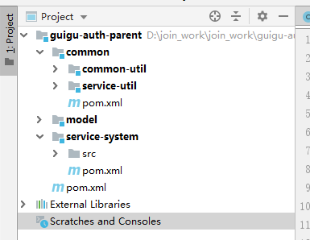
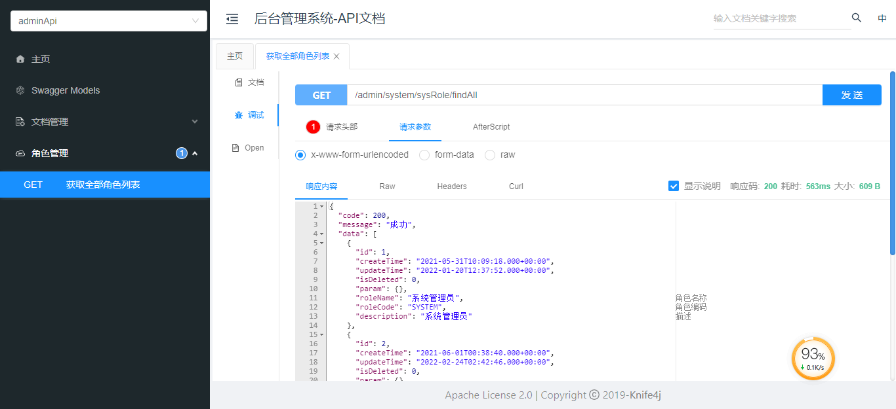

# 硅谷通用权限系统：搭建环境

## 一、项目介绍

### 1、介绍

权限管理是所有后台系统都会涉及的一个重要组成部分，而权限管理的核心流程是相似的，如果每个后台单独开发一套权限管理系统，就是重复造轮子，是人力的极大浪费，本项目就是针对这个问题，提供了一套通用的权限解决方案。

项目服务器端架构：SpringBoot + MyBatisPlus + SpringSecurity

前端架构：Node.js + Npm + Vue + ElementUI + Axios

### 2、核心技术

| 基础框架：SpringBoot                              |
| ------------------------------------------------- |
| 数据缓存：Redis                                   |
| 数据库：Mysql                                     |
| 权限控制：SpringSecurity                          |
| 全局日志记录：AOP                                 |
| 前端模板：vue-admin-template                      |
| 前端技术：Node.js + Npm + Vue + ElementUI + Axios |

### 3、项目模块

最终服务器端架构模块

guigu-auth-parent：根目录，管理子模块：

​	common：公共类父模块

​		common-log：系统操作日志模块

​		common-util：核心工具类

​		service-util：service模块工具类

​		spring-security：spring-security业务模块

​	model：实体类模块

​	service-system：系统权限模块

### 4、项目演示地址

硅谷通用权限系统演示地址：http://139.198.152.148:8810/

根据演示了解项目相关业务

### 5、数据库

数据库从资料文件中获取，导入数据库，数据库表如下：



### 6、其他资源

如：实体类、前端项目模板等都在资料文件夹中，后续再做说明。


## 二、搭建环境

目前先搭建“硅谷通用权限系统“项目模块。

### 1、搭建项目结构

#### 1.1、搭建父工程guigu-auth-parent

管理子模块及依赖

GroupId：com.atguigu

ArtifactId：guigu-auth-parent

第一步：新建工程


第二步：



第三步：

直接下一步到完成

删除src目录


#### 1.2、搭建工具类父模块common

工具类父模块，继承父工程guigu-auth-parent

GroupId：com.atguigu

ArtifactId：common

第一步：右键点击“guigu-auth-parent”新建"module"


第二步：

同上，忽略

#### 1.3、搭建工具类模块common-util

核心工具类，继承common模块

GroupId：com.atguigu

ArtifactId：common-util

第一步：右键点击“common”新建"module"


第二步：

同上，忽略

#### 1.4、搭建工具类模块service-util

service模块工具类，继承common模块

GroupId：com.atguigu

ArtifactId：service-util

搭建方式如：common-util

#### 1.5、搭建实体类模块model

实体类，继承guigu-auth-parent

搭建方式如：common

#### 1.6、搭建项目模块service-system

service服务模块，继承guigu-auth-parent

搭建方式如：common

项目结构如下：



### 2、配置依赖关系

#### 2.1、guigu-auth-parent父工程管理依赖版本

修改guigu-auth-parent模块pom.xml文件

```xml
<?xml version="1.0" encoding="UTF-8"?>
<project xmlns="http://maven.apache.org/POM/4.0.0"
         xmlns:xsi="http://www.w3.org/2001/XMLSchema-instance"
         xsi:schemaLocation="http://maven.apache.org/POM/4.0.0 http://maven.apache.org/xsd/maven-4.0.0.xsd">
    <modelVersion>4.0.0</modelVersion>

    <groupId>com.atguigu</groupId>
    <artifactId>guigu-auth-parent</artifactId>
    <packaging>pom</packaging>
    <version>1.0</version>

    <modules>
        <module>common</module>
        <module>model</module>
        <module>service-system</module>
    </modules>

	<parent>
        <groupId>org.springframework.boot</groupId>
        <artifactId>spring-boot-starter-parent</artifactId>
        <version>2.3.6.RELEASE</version>
    </parent>
    <properties>
        <java.version>1.8</java.version>
        <mybatis-plus.version>3.4.1</mybatis-plus.version>
        <mysql.version>8.0.23</mysql.version>
        <knife4j.version>2.0.8</knife4j.version>
        <jwt.version>0.7.0</jwt.version>
        <fastjson.version>1.2.29</fastjson.version>
    </properties>

    <!--配置dependencyManagement锁定依赖的版本-->
    <dependencyManagement>
        <dependencies>
            <!--mybatis-plus 持久层-->
            <dependency>
                <groupId>com.baomidou</groupId>
                <artifactId>mybatis-plus-boot-starter</artifactId>
                <version>${mybatis-plus.version}</version>
            </dependency>
            <!--mysql-->
            <dependency>
                <groupId>mysql</groupId>
                <artifactId>mysql-connector-java</artifactId>
                <version>${mysql.version}</version>
            </dependency>
            <!--knife4j-->
            <dependency>
                <groupId>com.github.xiaoymin</groupId>
                <artifactId>knife4j-spring-boot-starter</artifactId>
                <version>${knife4j.version}</version>
            </dependency>
            <!--jjwt-->
            <dependency>
                <groupId>io.jsonwebtoken</groupId>
                <artifactId>jjwt</artifactId>
                <version>${jwt.version}</version>
            </dependency>
            <!--fastjson-->
            <dependency>
                <groupId>com.alibaba</groupId>
                <artifactId>fastjson</artifactId>
                <version>${fastjson.version}</version>
            </dependency>
        </dependencies>
    </dependencyManagement>

    <build>
        <plugins>
            <plugin>
                <groupId>org.apache.maven.plugins</groupId>
                <artifactId>maven-compiler-plugin</artifactId>
                <version>3.1</version>
                <configuration>
                    <source>1.8</source>
                    <target>1.8</target>
                </configuration>
            </plugin>
        </plugins>
    </build>

</project>
```

#### 2.2、common模块

common公共父模块

```xml
<?xml version="1.0" encoding="UTF-8"?>
<project xmlns="http://maven.apache.org/POM/4.0.0"
         xmlns:xsi="http://www.w3.org/2001/XMLSchema-instance"
         xsi:schemaLocation="http://maven.apache.org/POM/4.0.0 http://maven.apache.org/xsd/maven-4.0.0.xsd">
    <parent>
        <artifactId>guigu-auth-parent</artifactId>
        <groupId>com.atguigu</groupId>
        <version>1.0</version>
    </parent>
    <modelVersion>4.0.0</modelVersion>

    <artifactId>common</artifactId>
    <packaging>pom</packaging>

    <modules>
        <module>service-util</module>
        <module>common-util</module>
    </modules>

</project>
```

#### 2.3、common-util模块

```xml
<?xml version="1.0" encoding="UTF-8"?>
<project xmlns="http://maven.apache.org/POM/4.0.0"
         xmlns:xsi="http://www.w3.org/2001/XMLSchema-instance"
         xsi:schemaLocation="http://maven.apache.org/POM/4.0.0 http://maven.apache.org/xsd/maven-4.0.0.xsd">
    <parent>
        <artifactId>common</artifactId>
        <groupId>com.atguigu</groupId>
        <version>1.0</version>
    </parent>
    <modelVersion>4.0.0</modelVersion>

    <artifactId>common-util</artifactId>
    <packaging>jar</packaging>

    <dependencies>
        <dependency>
            <groupId>com.atguigu</groupId>
            <artifactId>model</artifactId>
            <version>1.0</version>
        </dependency>
        <dependency>
            <groupId>org.springframework.boot</groupId>
            <artifactId>spring-boot-starter-web</artifactId>
            <scope>provided</scope>
        </dependency>
        <dependency>
            <groupId>io.jsonwebtoken</groupId>
            <artifactId>jjwt</artifactId>
        </dependency>
        <dependency>
            <groupId>org.projectlombok</groupId>
            <artifactId>lombok</artifactId>
        </dependency>
        <dependency>
            <groupId>com.alibaba</groupId>
            <artifactId>fastjson</artifactId>
        </dependency>
    </dependencies>
</project>
```

引入“02.资料/工具类”相关代码

#### 2.4、service-util模块

```xml
<?xml version="1.0" encoding="UTF-8"?>
<project xmlns="http://maven.apache.org/POM/4.0.0"
         xmlns:xsi="http://www.w3.org/2001/XMLSchema-instance"
         xsi:schemaLocation="http://maven.apache.org/POM/4.0.0 http://maven.apache.org/xsd/maven-4.0.0.xsd">
    <parent>
        <artifactId>common</artifactId>
        <groupId>com.atguigu</groupId>
        <version>1.0</version>
    </parent>
    <modelVersion>4.0.0</modelVersion>

    <artifactId>service-util</artifactId>

    <dependencies>
        <dependency>
            <groupId>com.atguigu</groupId>
            <artifactId>common-util</artifactId>
            <version>1.0</version>
        </dependency>
        <dependency>
            <groupId>org.springframework.boot</groupId>
            <artifactId>spring-boot-starter-web</artifactId>
        </dependency>
        <dependency>
            <groupId>com.baomidou</groupId>
            <artifactId>mybatis-plus-boot-starter</artifactId>
        </dependency>
        <!--mysql-->
        <dependency>
            <groupId>mysql</groupId>
            <artifactId>mysql-connector-java</artifactId>
        </dependency>
    </dependencies>

</project>
```

#### 2.5、model模块

```xml
<?xml version="1.0" encoding="UTF-8"?>
<project xmlns="http://maven.apache.org/POM/4.0.0"
         xmlns:xsi="http://www.w3.org/2001/XMLSchema-instance"
         xsi:schemaLocation="http://maven.apache.org/POM/4.0.0 http://maven.apache.org/xsd/maven-4.0.0.xsd">
    <parent>
        <artifactId>guigu-auth-parent</artifactId>
        <groupId>com.atguigu</groupId>
        <version>1.0</version>
    </parent>
    <modelVersion>4.0.0</modelVersion>

    <artifactId>model</artifactId>

    <dependencies>
        <!--lombok用来简化实体类-->
        <dependency>
            <groupId>org.projectlombok</groupId>
            <artifactId>lombok</artifactId>
        </dependency>
        <dependency>
            <groupId>com.github.xiaoymin</groupId>
            <artifactId>knife4j-spring-boot-starter</artifactId>
            <scope>provided</scope>
        </dependency>
        <dependency>
            <groupId>com.baomidou</groupId>
            <artifactId>mybatis-plus-boot-starter</artifactId>
            <scope>provided</scope>
        </dependency>
    </dependencies>

</project>
```

引入“02.资料/实体类”相关代码

idea中安装lombok插件**


#### 2.6、service-system模块

```xml
<?xml version="1.0" encoding="UTF-8"?>
<project xmlns="http://maven.apache.org/POM/4.0.0"
         xmlns:xsi="http://www.w3.org/2001/XMLSchema-instance"
         xsi:schemaLocation="http://maven.apache.org/POM/4.0.0 http://maven.apache.org/xsd/maven-4.0.0.xsd">
    <parent>
        <artifactId>guigu-auth-parent</artifactId>
        <groupId>com.atguigu</groupId>
        <version>1.0</version>
    </parent>
    <modelVersion>4.0.0</modelVersion>

    <artifactId>service-system</artifactId>
    <packaging>jar</packaging>

    <dependencies>
        <dependency>
            <groupId>com.atguigu</groupId>
            <artifactId>service-util</artifactId>
            <version>1.0</version>
        </dependency>
        
        <dependency>
            <groupId>org.springframework.boot</groupId>
            <artifactId>spring-boot-starter-test</artifactId>
            <scope>test</scope>
        </dependency>
    </dependencies>

    <build>
        <finalName>${project.artifactId}</finalName>
        <plugins>
            <plugin>
                <groupId>org.springframework.boot</groupId>
                <artifactId>spring-boot-maven-plugin</artifactId>
            </plugin>
        </plugins>
    </build>
</project>
```

## 三、Mybatis-Plus

官网：https://baomidou.com/

### 1、简介

[MyBatis-Plus ](https://github.com/baomidou/mybatis-plus)（简称 MP）是一个 [MyBatis ](https://www.mybatis.org/mybatis-3/)的增强工具，在 MyBatis 的基础上只做增强不做改变，为简化开发、提高效率而生。

### 2、特点

- **无侵入**：只做增强不做改变，引入它不会对现有工程产生影响，如丝般顺滑
- **损耗小**：启动即会自动注入基本 CURD，性能基本无损耗，直接面向对象操作
- **强大的 CRUD 操作**：内置通用 Mapper、通用 Service，仅仅通过少量配置即可实现单表大部分 CRUD 操作，更有强大的条件构造器，满足各类使用需求
- **支持 Lambda 形式调用**：通过 Lambda 表达式，方便的编写各类查询条件，无需再担心字段写错
- **支持主键自动生成**：支持多达 4 种主键策略（内含分布式唯一 ID 生成器 - Sequence），可自由配置，完美解决主键问题
- **支持 ActiveRecord 模式**：支持 ActiveRecord 形式调用，实体类只需继承 Model 类即可进行强大的 CRUD 操作
- **支持自定义全局通用操作**：支持全局通用方法注入（ Write once, use anywhere ）
- **内置代码生成器**：采用代码或者 Maven 插件可快速生成 Mapper 、 Model 、 Service 、 Controller 层代码，支持模板引擎，更有超多自定义配置等您来使用
- **内置分页插件**：基于 MyBatis 物理分页，开发者无需关心具体操作，配置好插件之后，写分页等同于普通 List 查询
- **分页插件支持多种数据库**：支持 MySQL、MariaDB、Oracle、DB2、H2、HSQL、SQLite、Postgre、SQLServer 等多种数据库
- **内置性能分析插件**：可输出 SQL 语句以及其执行时间，建议开发测试时启用该功能，能快速揪出慢查询
- **内置全局拦截插件**：提供全表 delete 、 update 操作智能分析阻断，也可自定义拦截规则，预防误操作

### 3、支持数据库

MySQL，Oracle，DB2，H2，HSQL，SQLite，PostgreSQL，SQLServer，Phoenix，Gauss ，ClickHouse，Sybase，OceanBase，Firebird，Cubrid，Goldilocks，csiidb等。

### 4、依赖

```xml
<dependency>
    <groupId>com.baomidou</groupId>
    <artifactId>mybatis-plus-boot-starter</artifactId>
    <version>3.4.1</version>
</dependency>
```

## 四、Mybatis-Plus入门

前面介绍了Mybatis-Plus，当前就以角色管理为例在service-system模块中讲解Mybatis-Plus的使用

### 1、配置文件

配置 MySQL 数据库的相关配置及Mybatis-Plus日志

application.yml

```yaml
spring:
  application:
    name: service-system
  profiles:
    active: dev
```

application-dev.yml

```yaml
server:
  port: 8800
mybatis-plus:
  configuration:
    log-impl: org.apache.ibatis.logging.stdout.StdOutImpl # 查看日志
spring:
  datasource:
    driver-class-name: com.mysql.cj.jdbc.Driver
    url: jdbc:mysql://localhost:3306/guigu-auth?characterEncoding=utf-8&useSSL=false
    username: root
    password: root
```

### 2、启动类

在 Spring Boot 启动类中添加 `@MapperScan` 注解，扫描 Mapper 文件夹：

```java
package com.atguigu.system;

import org.springframework.boot.SpringApplication;
import org.springframework.boot.autoconfigure.SpringBootApplication;

@MapperScan(basePackages = "com.atguigu.system.mapper")
@SpringBootApplication
public class ServiceAuthApplication {

    public static void main(String[] args) {
        SpringApplication.run(ServiceAuthApplication.class, args);
    }

}
```

### 3、实体类

已引入，实体类说明：

实体类注解详细文档：https://baomidou.com/pages/223848/

@TableName：表名注解，标识实体类对应的表

@TableId：主键注解，type = IdType.AUTO（数据库 ID 自增）

@TableField：字段注解（非主键）

@TableLogic：逻辑删除

```java
package com.atguigu.model.system;

import com.baomidou.mybatisplus.annotation.TableField;
import com.baomidou.mybatisplus.annotation.TableName;
import com.atguigu.model.base.BaseEntity;
import lombok.Data;

@Data
@TableName("sys_role")
public class SysRole extends BaseEntity {
   
   private static final long serialVersionUID = 1L;

   //角色名称
   @TableField("role_name")
   private String roleName;

   //角色编码
   @TableField("role_code")
   private String roleCode;

   //描述
   @TableField("description")
   private String description;

}
```

### 4、添加Mapper类

```java
package com.atguigu.system.mapper;

import com.atguigu.model.auth.SysRole;
import com.baomidou.mybatisplus.core.mapper.BaseMapper;
import org.apache.ibatis.annotations.Mapper;

@Repository
public interface SysRoleMapper extends BaseMapper<SysRole> {

}
```

com.baomidou.mybatisplus.core.mapper.BaseMapper这是Mybatis-Plus提供的默认Mapper接口。

```java
package com.baomidou.mybatisplus.core.mapper;

import com.baomidou.mybatisplus.core.conditions.Wrapper;
import com.baomidou.mybatisplus.core.metadata.IPage;
import java.io.Serializable;
import java.util.Collection;
import java.util.List;
import java.util.Map;
import org.apache.ibatis.annotations.Param;

public interface BaseMapper<T> extends Mapper<T> {
    int insert(T entity);

    int deleteById(Serializable id);

    int deleteByMap(@Param("cm") Map<String, Object> columnMap);

    int delete(@Param("ew") Wrapper<T> queryWrapper);

    int deleteBatchIds(@Param("coll") Collection<? extends Serializable> idList);

    int updateById(@Param("et") T entity);

    int update(@Param("et") T entity, @Param("ew") Wrapper<T> updateWrapper);

    T selectById(Serializable id);

    List<T> selectBatchIds(@Param("coll") Collection<? extends Serializable> idList);

    List<T> selectByMap(@Param("cm") Map<String, Object> columnMap);

    T selectOne(@Param("ew") Wrapper<T> queryWrapper);

    Integer selectCount(@Param("ew") Wrapper<T> queryWrapper);

    List<T> selectList(@Param("ew") Wrapper<T> queryWrapper);

    List<Map<String, Object>> selectMaps(@Param("ew") Wrapper<T> queryWrapper);

    List<Object> selectObjs(@Param("ew") Wrapper<T> queryWrapper);

    <E extends IPage<T>> E selectPage(E page, @Param("ew") Wrapper<T> queryWrapper);

    <E extends IPage<Map<String, Object>>> E selectMapsPage(E page, @Param("ew") Wrapper<T> queryWrapper);
}
```

### 5、测试Mapper接口

```java
package com.atguigu.system;

import com.atguigu.model.system.SysRole;
import com.atguigu.system.mapper.SysRoleMapper;
import org.junit.jupiter.api.Test;
import org.springframework.beans.factory.annotation.Autowired;
import org.springframework.boot.test.context.SpringBootTest;
import org.springframework.test.context.junit4.SpringRunner;

import java.util.List;

@SpringBootTest
@RunWith(SpringJUnit4ClassRunner.class)
public class SysRoleMapperTest {

    @Autowired
    private SysRoleMapper sysRoleMapper;

    @Test
    public void testSelectList() {
        System.out.println(("----- selectAll method test ------"));
        //UserMapper 中的 selectList() 方法的参数为 MP 内置的条件封装器 Wrapper
        //所以不填写就是无任何条件
        List<SysRole> users = sysRoleMapper.selectList(null);
       	for (SysRole sysRole : sysRoles) {
           System.out.println("sysRole = " + sysRole);
        }
    }
}
```

**注意：**

IDEA在sysRoleMapper处报错，因为找不到注入的对象，因为类是动态创建的，但是程序可以正确的执行。

为了避免报错，可以在 mapper 层 的接口上添加 @Repository 或直接使用 @Resource 代替 @Autowired。

控制台输出：


通过以上几个简单的步骤，我们就实现了 User 表的 CRUD 功能，甚至连 XML 文件都不用编写！

### 6、CRUD测试

#### 6.1、insert添加

##### 6.1.1、示例

```java
@Test
public void testInsert(){
    SysRole sysRole = new SysRole();
    sysRole.setRoleName("角色管理员");
    sysRole.setRoleCode("role");
    sysRole.setDescription("角色管理员");

    int result = sysRoleMapper.insert(sysRole);
    System.out.println(result); //影响的行数
    System.out.println(sysRole.getId()); //id自动回填
}
```

##### 6.1.2、主键策略

**1、ID_WORKER**

MyBatis-Plus默认的主键策略是：ID_WORKER  *全局唯一ID*

**2、自增策略**

- 要想主键自增需要配置如下主键策略

- - 需要在创建数据表的时候设置主键自增
  - 实体字段中配置 @TableId(type = IdType.AUTO)

```java
@TableId(type = IdType.AUTO)
private Long id;
```

其它主键策略：分析 IdType 源码可知

```java
public enum IdType {
     /**
     * 数据库ID自增
     */
    AUTO(0),
    
    /**
     * 该类型为未设置主键类型
     */
    NONE(1),
    
    /**
     * 用户输入ID
     * 该类型可以通过自己注册自动填充插件进行填充
     */    
    INPUT(2),
    
    /**
     * 全局唯一ID
     */    
    ASSIGN_ID(3),
    
    /**
     * 全局唯一ID (UUID)
     */
    ASSIGN_UUID(4),
    
    /** @deprecated */
    @Deprecated
    ID_WORKER(3),
    /** @deprecated */
    @Deprecated
    ID_WORKER_STR(3),
    /** @deprecated */
    @Deprecated
    UUID(4);
    private final int key;
    private IdType(int key) {
        this.key = key;
    }
    public int getKey() {
        return this.key;
    }
}
```

#### 6.2、更新

```java
@Test
public void testUpdateById(){
    SysRole sysRole = new SysRole();
    sysRole.setId(1L);
    sysRole.setRoleName("角色管理员1");

    int result = sysRoleMapper.updateById(sysRole);
    System.out.println(result);

}
```

#### 6.3、删除

##### 6.3.1、根据id删除

```java
/**
 * application-dev.yml 加入配置
 * 此为默认值，如果你的默认值和默认的一样，则不需要该配置
 * mybatis-plus:
 *   global-config:
 *     db-config:
 *       logic-delete-value: 1
 *       logic-not-delete-value: 0
 */
@Test
public void testDeleteById(){
    int result = sysRoleMapper.deleteById(2L);
    System.out.println(result);
}
```

##### 6.3.2、批量删除

```java
@Test
public void testDeleteBatchIds() {
    int result = sysRoleMapper.deleteBatchIds(Arrays.asList(1, 2));
    System.out.println(result);
}
```

#### 6.4、MyBatis-Plus条件构造器


Wrapper ： 条件构造抽象类，最顶端父类

  AbstractWrapper ： 用于查询条件封装，生成 sql 的 where 条件

​    QueryWrapper ： Entity 对象封装操作类，不是用lambda语法

​    UpdateWrapper ： Update 条件封装，用于Entity对象更新操作

  AbstractLambdaWrapper ： Lambda 语法使用 Wrapper统一处理解析 lambda 获取 column。

​    LambdaQueryWrapper ：看名称也能明白就是用于Lambda语法使用的查询Wrapper

​    LambdaUpdateWrapper ： Lambda 更新封装Wrapper

**注意：以下条件构造器的方法入参中的 `column `均表示数据库字段**

```java
@Test
public void testQueryWrapper() {
    QueryWrapper<SysRole> queryWrapper = new QueryWrapper<>();
    queryWrapper.ge("role_code", "role");
    List<SysRole> users = sysRoleMapper.selectList(queryWrapper);
    System.out.println(users);
}
```

其他条件构造有兴趣的可自行测试

### 6、MyBatis-Plus封装service层

#### 6.1、添加service接口

```java
package com.atguigu.system.service;

import com.atguigu.model.auth.SysRole;
import com.baomidou.mybatisplus.extension.service.IService;

import java.util.List;

public interface SysRoleService extends IService<SysRole> {

}

```

com.baomidou.mybatisplus.extension.service.IService这是Mybatis-Plus提供的默认Service接口。

```java
package com.baomidou.mybatisplus.extension.service;

import com.baomidou.mybatisplus.core.conditions.Wrapper;
import com.baomidou.mybatisplus.core.mapper.BaseMapper;
import com.baomidou.mybatisplus.core.metadata.IPage;
import com.baomidou.mybatisplus.core.toolkit.Assert;
import com.baomidou.mybatisplus.core.toolkit.CollectionUtils;
import com.baomidou.mybatisplus.core.toolkit.Wrappers;
import com.baomidou.mybatisplus.extension.conditions.query.LambdaQueryChainWrapper;
import com.baomidou.mybatisplus.extension.conditions.query.QueryChainWrapper;
import com.baomidou.mybatisplus.extension.conditions.update.LambdaUpdateChainWrapper;
import com.baomidou.mybatisplus.extension.conditions.update.UpdateChainWrapper;
import com.baomidou.mybatisplus.extension.kotlin.KtQueryChainWrapper;
import com.baomidou.mybatisplus.extension.kotlin.KtUpdateChainWrapper;
import com.baomidou.mybatisplus.extension.toolkit.ChainWrappers;
import com.baomidou.mybatisplus.extension.toolkit.SqlHelper;
import java.io.Serializable;
import java.util.Collection;
import java.util.List;
import java.util.Map;
import java.util.Objects;
import java.util.function.Function;
import java.util.stream.Collectors;
import org.springframework.transaction.annotation.Transactional;

public interface IService<T> {
    int DEFAULT_BATCH_SIZE = 1000;

    default boolean save(T entity) {
        return SqlHelper.retBool(this.getBaseMapper().insert(entity));
    }

    @Transactional(
        rollbackFor = {Exception.class}
    )
    default boolean saveBatch(Collection<T> entityList) {
        return this.saveBatch(entityList, 1000);
    }

    boolean saveBatch(Collection<T> entityList, int batchSize);

    @Transactional(
        rollbackFor = {Exception.class}
    )
    default boolean saveOrUpdateBatch(Collection<T> entityList) {
        return this.saveOrUpdateBatch(entityList, 1000);
    }

    boolean saveOrUpdateBatch(Collection<T> entityList, int batchSize);

    default boolean removeById(Serializable id) {
        return SqlHelper.retBool(this.getBaseMapper().deleteById(id));
    }

    default boolean removeByMap(Map<String, Object> columnMap) {
        Assert.notEmpty(columnMap, "error: columnMap must not be empty", new Object[0]);
        return SqlHelper.retBool(this.getBaseMapper().deleteByMap(columnMap));
    }

    default boolean remove(Wrapper<T> queryWrapper) {
        return SqlHelper.retBool(this.getBaseMapper().delete(queryWrapper));
    }

    default boolean removeByIds(Collection<? extends Serializable> idList) {
        return CollectionUtils.isEmpty(idList) ? false : SqlHelper.retBool(this.getBaseMapper().deleteBatchIds(idList));
    }

    default boolean updateById(T entity) {
        return SqlHelper.retBool(this.getBaseMapper().updateById(entity));
    }

    default boolean update(Wrapper<T> updateWrapper) {
        return this.update((Object)null, updateWrapper);
    }

    default boolean update(T entity, Wrapper<T> updateWrapper) {
        return SqlHelper.retBool(this.getBaseMapper().update(entity, updateWrapper));
    }

    @Transactional(
        rollbackFor = {Exception.class}
    )
    default boolean updateBatchById(Collection<T> entityList) {
        return this.updateBatchById(entityList, 1000);
    }

    boolean updateBatchById(Collection<T> entityList, int batchSize);

    boolean saveOrUpdate(T entity);

    default T getById(Serializable id) {
        return this.getBaseMapper().selectById(id);
    }

    default List<T> listByIds(Collection<? extends Serializable> idList) {
        return this.getBaseMapper().selectBatchIds(idList);
    }

    default List<T> listByMap(Map<String, Object> columnMap) {
        return this.getBaseMapper().selectByMap(columnMap);
    }

    default T getOne(Wrapper<T> queryWrapper) {
        return this.getOne(queryWrapper, true);
    }

    T getOne(Wrapper<T> queryWrapper, boolean throwEx);

    Map<String, Object> getMap(Wrapper<T> queryWrapper);

    <V> V getObj(Wrapper<T> queryWrapper, Function<? super Object, V> mapper);

    default int count() {
        return this.count(Wrappers.emptyWrapper());
    }

    default int count(Wrapper<T> queryWrapper) {
        return SqlHelper.retCount(this.getBaseMapper().selectCount(queryWrapper));
    }

    default List<T> list(Wrapper<T> queryWrapper) {
        return this.getBaseMapper().selectList(queryWrapper);
    }

    default List<T> list() {
        return this.list(Wrappers.emptyWrapper());
    }

    default <E extends IPage<T>> E page(E page, Wrapper<T> queryWrapper) {
        return this.getBaseMapper().selectPage(page, queryWrapper);
    }

    default <E extends IPage<T>> E page(E page) {
        return this.page(page, Wrappers.emptyWrapper());
    }

    default List<Map<String, Object>> listMaps(Wrapper<T> queryWrapper) {
        return this.getBaseMapper().selectMaps(queryWrapper);
    }

    default List<Map<String, Object>> listMaps() {
        return this.listMaps(Wrappers.emptyWrapper());
    }

    default List<Object> listObjs() {
        return this.listObjs(Function.identity());
    }

    default <V> List<V> listObjs(Function<? super Object, V> mapper) {
        return this.listObjs(Wrappers.emptyWrapper(), mapper);
    }

    default List<Object> listObjs(Wrapper<T> queryWrapper) {
        return this.listObjs(queryWrapper, Function.identity());
    }

    default <V> List<V> listObjs(Wrapper<T> queryWrapper, Function<? super Object, V> mapper) {
        return (List)this.getBaseMapper().selectObjs(queryWrapper).stream().filter(Objects::nonNull).map(mapper).collect(Collectors.toList());
    }

    default <E extends IPage<Map<String, Object>>> E pageMaps(E page, Wrapper<T> queryWrapper) {
        return this.getBaseMapper().selectMapsPage(page, queryWrapper);
    }

    default <E extends IPage<Map<String, Object>>> E pageMaps(E page) {
        return this.pageMaps(page, Wrappers.emptyWrapper());
    }

    BaseMapper<T> getBaseMapper();

    Class<T> getEntityClass();

    default QueryChainWrapper<T> query() {
        return ChainWrappers.queryChain(this.getBaseMapper());
    }

    default LambdaQueryChainWrapper<T> lambdaQuery() {
        return ChainWrappers.lambdaQueryChain(this.getBaseMapper());
    }

    default KtQueryChainWrapper<T> ktQuery() {
        return ChainWrappers.ktQueryChain(this.getBaseMapper(), this.getEntityClass());
    }

    default KtUpdateChainWrapper<T> ktUpdate() {
        return ChainWrappers.ktUpdateChain(this.getBaseMapper(), this.getEntityClass());
    }

    default UpdateChainWrapper<T> update() {
        return ChainWrappers.updateChain(this.getBaseMapper());
    }

    default LambdaUpdateChainWrapper<T> lambdaUpdate() {
        return ChainWrappers.lambdaUpdateChain(this.getBaseMapper());
    }

    default boolean saveOrUpdate(T entity, Wrapper<T> updateWrapper) {
        return this.update(entity, updateWrapper) || this.saveOrUpdate(entity);
    }
}
```

#### 6.2、添加service接口实现

```java
package com.atguigu.system.service.impl;

import com.atguigu.auth.mapper.SysRoleMapper;
import com.atguigu.auth.service.SysRoleService;
import com.atguigu.model.auth.SysRole;
import com.baomidou.mybatisplus.core.conditions.query.LambdaQueryWrapper;
import com.baomidou.mybatisplus.extension.service.impl.ServiceImpl;
import org.springframework.stereotype.Service;
import org.springframework.beans.factory.annotation.Autowired;

import java.util.List;

@Transactional
@Service
public class SysRoleServiceImpl extends ServiceImpl<SysRoleMapper, SysRole> implements SysRoleService {
}
```

com.baomidou.mybatisplus.extension.service.impl.ServiceImpl这是Mybatis-Plus提供的默认Service接口实现。

#### 6.3、测试Service接口

```java
package com.atguigu.system;

import com.atguigu.model.system.SysRole;
import com.atguigu.system.mapper.SysRoleMapper;
import com.atguigu.system.service.SysRoleService;
import com.baomidou.mybatisplus.core.conditions.query.LambdaQueryWrapper;
import com.baomidou.mybatisplus.core.conditions.query.QueryWrapper;
import org.junit.jupiter.api.Test;
import org.junit.runner.RunWith;
import org.springframework.beans.factory.annotation.Autowired;
import org.springframework.boot.test.context.SpringBootTest;
import org.springframework.test.context.junit4.SpringRunner;

import java.util.List;

@SpringBootTest
public class SysRoleServiceTest {

    @Autowired
    private SysRoleService sysRoleService;

    @Test
    public void testSelectList() {
        System.out.println(("----- selectAll method test ------"));
        //UserMapper 中的 selectList() 方法的参数为 MP 内置的条件封装器 Wrapper
        //所以不填写就是无任何条件
        List<SysRole> roles = sysRoleService.list();
        for (SysRole role : roles) {
            System.out.println("role = " + role);
        }
    }

    @Test
    public void testInsert(){
        SysRole sysRole = new SysRole();
        sysRole.setRoleName("角色管理员");
        sysRole.setRoleCode("role");
        sysRole.setDescription("角色管理员");

        boolean result = sysRoleService.save(sysRole);
        System.out.println(result); //成功还是失败
    }

    @Test
    public void testUpdateById(){
        SysRole sysRole = new SysRole();
        sysRole.setId(1L);
        sysRole.setRoleName("角色管理员1");

        boolean result = sysRoleService.updateById(sysRole);
        System.out.println(result);

    }

    @Test
    public void testDeleteById(){
        boolean result = sysRoleService.removeById(2L);
        System.out.println(result);
    }

    @Test
    public void testQueryWrapper() {
        QueryWrapper<SysRole> queryWrapper = new QueryWrapper<>();
        queryWrapper.ge("role_code", "role");
        List<SysRole> users = sysRoleService.list(queryWrapper);
        System.out.println(users);
    }
}
```

## 五、角色管理

### 1、测试controller层

#### 1.1、添加Controller

```java
package com.atguigu.system.controller;

import com.atguigu.auth.service.SysRoleService;
import com.atguigu.model.auth.SysRole;
import org.springframework.beans.factory.annotation.Autowired;
import org.springframework.web.bind.annotation.GetMapping;
import org.springframework.web.bind.annotation.RequestMapping;
import org.springframework.web.bind.annotation.RestController;

import java.util.List;

@RestController
@RequestMapping("/admin/system/sysRole")
public class SysRoleController {

    @Autowired
    private SysRoleService sysRoleService;

    @GetMapping("/findAll")
    public List<SysRole> findAll() {
        List<SysRole> roleList = sysRoleService.list();
        return roleList;
    }
}
```

#### 1.2、测试Controller接口

http://localhost:8800/admin/system/sysRole/findAll

### 2、定义统一返回结果对象

项目中我们会将响应封装成json返回，一般我们会将所有接口的数据格式统一， 使前端(iOS Android, Web)对数据的操作更一致、轻松。

一般情况下，统一返回数据格式没有固定的格式，只要能描述清楚返回的数据状态以及要返回的具体数据就可以。但是一般会包含状态码、返回消息、数据这几部分内容

例如，我们的系统要求返回的基本数据格式如下：

**列表：**

```json
{
  "code": 200,
  "message": "成功",
  "data": [
    {
      "id": 2,
      "roleName": "系统管理员"
    }
  ],
  "ok": true
}
```

**分页：**

```json
{
  "code": 200,
  "message": "成功",
  "data": {
    "records": [
      {
        "id": 2,
        "roleName": "系统管理员"
      },
      {
        "id": 3,
        "name": "普通管理员"
      }
    ],
    "total": 10,
    "size": 3,
    "current": 1,
    "orders": [],
    "hitCount": false,
    "searchCount": true,
    "pages": 2
  },
  "ok": true
}
```

**没有返回数据：**

```json
{
  "code": 200,
  "message": "成功",
  "data": null,
  "ok": true
}
```

**失败：**

```json
{
  "code": 201,
  "message": "失败",
  "data": null,
  "ok": false
}
```

#### 2.1、定义统一返回结果对象

操作模块：common-util

后续其他模块也会用到，故抽取到common-util模块

```java
package com.atguigu.common.result;


import lombok.Data;

/**
 * 全局统一返回结果类
 *
 */
@Data
public class Result<T> {

    //返回码
    private Integer code;

    //返回消息
    private String message;

    //返回数据
    private T data;

    public Result(){}

    // 返回数据
    protected static <T> Result<T> build(T data) {
        Result<T> result = new Result<T>();
        if (data != null)
            result.setData(data);
        return result;
    }

    public static <T> Result<T> build(T body, Integer code, String message) {
        Result<T> result = build(body);
        result.setCode(code);
        result.setMessage(message);
        return result;
    }

    public static <T> Result<T> build(T body, ResultCodeEnum resultCodeEnum) {
        Result<T> result = build(body);
        result.setCode(resultCodeEnum.getCode());
        result.setMessage(resultCodeEnum.getMessage());
        return result;
    }

    public static<T> Result<T> ok(){
        return Result.ok(null);
    }

    /**
     * 操作成功
     * @param data  baseCategory1List
     * @param <T>
     * @return
     */
    public static<T> Result<T> ok(T data){
        Result<T> result = build(data);
        return build(data, ResultCodeEnum.SUCCESS);
    }

    public static<T> Result<T> fail(){
        return Result.fail(null);
    }

    /**
     * 操作失败
     * @param data
     * @param <T>
     * @return
     */
    public static<T> Result<T> fail(T data){
        Result<T> result = build(data);
        return build(data, ResultCodeEnum.FAIL);
    }

    public Result<T> message(String msg){
        this.setMessage(msg);
        return this;
    }

    public Result<T> code(Integer code){
        this.setCode(code);
        return this;
    }
}
```

统一返回结果状态信息类

下面的状态后续都会用到，所以直接引入了

```java
package com.atguigu.common.result;

import lombok.Getter;

/**
 * 统一返回结果状态信息类
 *
 */
@Getter
public enum ResultCodeEnum {

    SUCCESS(200,"成功"),
    FAIL(201, "失败"),
    SERVICE_ERROR(2012, "服务异常"),
    DATA_ERROR(204, "数据异常"),
    ILLEGAL_REQUEST(205, "非法请求"),
    REPEAT_SUBMIT(206, "重复提交"),
    ARGUMENT_VALID_ERROR(210, "参数校验异常"),

    LOGIN_AUTH(208, "未登陆"),
    PERMISSION(209, "没有权限"),
    ACCOUNT_ERROR(214, "账号不正确"),
    PASSWORD_ERROR(215, "密码不正确"),
    LOGIN_MOBLE_ERROR( 216, "账号不正确"),
    ACCOUNT_STOP( 217, "账号已停用"),
    NODE_ERROR( 218, "该节点下有子节点，不可以删除")
    ;

    private Integer code;

    private String message;

    private ResultCodeEnum(Integer code, String message) {
        this.code = code;
        this.message = message;
    }
}
```

#### 2.2、改造controller方法

```java
@GetMapping("/findAll")
public Result<List<SysRole>> findAll() {
    List<SysRole> roleList = sysRoleService.list();
    return Result.ok(roleList);
}
```

#### 2.3、测试接口

http://localhost:8800/admin/system/sysRole/findAll

### 3、knife4j

文档地址：https://doc.xiaominfo.com/

knife4j是为Java MVC框架集成Swagger生成Api文档的增强解决方案。

#### 3.1、Swagger介绍

前后端分离开发模式中，api文档是最好的沟通方式。

Swagger 是一个规范和完整的框架，用于生成、描述、调用和可视化 RESTful 风格的 Web 服务。

1、及时性 (接口变更后，能够及时准确地通知相关前后端开发人员)

2、规范性 (并且保证接口的规范性，如接口的地址，请求方式，参数及响应格式和错误信息)

3、一致性 (接口信息一致，不会出现因开发人员拿到的文档版本不一致，而出现分歧)

4、可测性 (直接在接口文档上进行测试，以方便理解业务)

#### 3.2、集成knife4j

knife4j属于service模块公共资源，因此我们集成到service-uitl模块

##### 3.2.1 添加依赖

操作模块：service-uitl

```xml
<dependency>
    <groupId>com.github.xiaoymin</groupId>
    <artifactId>knife4j-spring-boot-starter</artifactId>
</dependency>
```

说明：guigu-auth-parent已加入版本管理

##### 3.2.2 添加knife4j配置类

操作模块：service-uitl

```java
package com.atguigu.system.config;

import org.springframework.context.annotation.Bean;
import org.springframework.context.annotation.Configuration;
import springfox.documentation.builders.ApiInfoBuilder;
import springfox.documentation.builders.ParameterBuilder;
import springfox.documentation.builders.PathSelectors;
import springfox.documentation.builders.RequestHandlerSelectors;
import springfox.documentation.schema.ModelRef;
import springfox.documentation.service.ApiInfo;
import springfox.documentation.service.Contact;
import springfox.documentation.service.Parameter;
import springfox.documentation.spi.DocumentationType;
import springfox.documentation.spring.web.plugins.Docket;
import springfox.documentation.swagger2.annotations.EnableSwagger2WebMvc;

import java.util.ArrayList;
import java.util.List;

/**
 * knife4j配置信息
 */
@Configuration
@EnableSwagger2WebMvc
public class Knife4jConfig {

    @Bean
    public Docket adminApiConfig(){
        List<Parameter> pars = new ArrayList<>();
        ParameterBuilder tokenPar = new ParameterBuilder();
        tokenPar.name("token")
                .description("用户token")
                .defaultValue("")
                .modelRef(new ModelRef("string"))
                .parameterType("header")
                .required(false)
                .build();
        pars.add(tokenPar.build());
        //添加head参数end

        Docket adminApi = new Docket(DocumentationType.SWAGGER_2)
                .groupName("adminApi")
                .apiInfo(adminApiInfo())
                .select()
                //只显示admin路径下的页面
                .apis(RequestHandlerSelectors.basePackage("com.atguigu"))
                .paths(PathSelectors.regex("/admin/.*"))
                .build()
                .globalOperationParameters(pars);
        return adminApi;
    }

    private ApiInfo adminApiInfo(){

        return new ApiInfoBuilder()
                .title("后台管理系统-API文档")
                .description("本文档描述了后台管理系统微服务接口定义")
                .version("1.0")
                .contact(new Contact("qy", "http://atguigu.com", "493290402@qq.com"))
                .build();
    }


}
```

##### 3.2.3 Controller层添加注解

```java
package com.atguigu.system.controller;

import com.atguigu.system.service.SysRoleService;
import com.atguigu.common.result.Result;
import com.atguigu.model.system.SysRole;
import io.swagger.annotations.Api;
import io.swagger.annotations.ApiOperation;
import org.springframework.beans.factory.annotation.Autowired;
import org.springframework.web.bind.annotation.GetMapping;
import org.springframework.web.bind.annotation.RequestMapping;
import org.springframework.web.bind.annotation.RestController;

import java.util.List;

@Api(tags = "角色管理")
@RestController
@RequestMapping("/admin/system/sysRole")
public class SysRoleController {

    @Autowired
    private SysRoleService sysRoleService;

    @ApiOperation(value = "获取全部角色列表")
    @GetMapping("findAll")
    public Result<List<SysRole>> findAll() {
        List<SysRole> roleList = sysRoleService.list();
        return Result.ok(roleList);
    }
}
```

##### 3.2.4、测试

http://localhost:8800/doc.html



### 4、分页查询

#### 4.1、配置分页插件

操作模块：service-uitl，service公共资源

说明：我们将@MapperScan("com.atguigu.system.mapper")提取到该配置类上面，统一管理，启动类就不需要了。

```java
package com.atguigu.system.config;

import com.baomidou.mybatisplus.annotation.DbType;
import com.baomidou.mybatisplus.extension.plugins.MybatisPlusInterceptor;
import com.baomidou.mybatisplus.extension.plugins.PaginationInterceptor;
import com.baomidou.mybatisplus.extension.plugins.inner.PaginationInnerInterceptor;
import org.mybatis.spring.annotation.MapperScan;
import org.springframework.context.annotation.Bean;
import org.springframework.context.annotation.Configuration;
import org.springframework.transaction.annotation.EnableTransactionManagement;

/**
 * MybatisPlus配置类
 *
 */
@EnableTransactionManagement
@Configuration
@MapperScan("com.atguigu.system.mapper")
public class MybatisPlusConfig {

    /**
     *
     * @return
     */
    @Bean
    public MybatisPlusInterceptor addPaginationInnerInterceptor(){
        MybatisPlusInterceptor interceptor = new MybatisPlusInterceptor();
        //向Mybatis过滤器链中添加分页拦截器
        interceptor.addInnerInterceptor(new PaginationInnerInterceptor(DbType.MYSQL));
        return interceptor;
    }

}
```

#### 4.2、分页controller

```java
@ApiOperation(value = "获取分页列表")
@GetMapping("/{page}/{limit}")
public Result index(
        @ApiParam(name = "page", value = "当前页码", required = true)
        @PathVariable Long page,

        @ApiParam(name = "limit", value = "每页记录数", required = true)
        @PathVariable Long limit,

        @ApiParam(name = "roleQueryVo", value = "查询对象", required = false)
                SysRoleQueryVo roleQueryVo) {
    Page<SysRole> pageParam = new Page<>(page, limit);
    IPage<SysRole> pageModel = sysRoleService.selectPage(pageParam, roleQueryVo);
    return Result.ok(pageModel);
}
```

#### 4.2、service

```java
IPage<SysRole> selectPage(Page<SysRole> pageParam, SysRoleQueryVo roleQueryVo);
```

```java
@Override
public IPage<SysRole> selectPage(Page<SysRole> pageParam, SysRoleQueryVo roleQueryVo) {

    return sysRoleMapper.selectPage(pageParam, roleQueryVo);
}
```

#### 4.3、mapper

```java
IPage<SysRole> selectPage(Page<SysRole> page, @Param("vo") SysRoleQueryVo roleQueryVo);
```

#### 4.4、xml

在resources目录下创建mapper/SysRoleMapper.xml文件

说明：分页我们统一定义到xml文件中，更方便直观

```xml
<?xml version="1.0" encoding="UTF-8" ?>
<!DOCTYPE mapper
        PUBLIC "-//mybatis.org//DTD Mapper 3.0//EN"
        "http://mybatis.org/dtd/mybatis-3-mapper.dtd">

<mapper namespace="com.atguigu.system.mapper.SysRoleMapper">

    <resultMap id="RoleMap" type="com.atguigu.model.system.SysRole" autoMapping="true">
    </resultMap>

    <!-- 用于select查询公用抽取的列 -->
    <sql id="columns">
        id,role_name,role_code,description,create_time,update_time,is_deleted
    </sql>

    <select id="selectPage" resultMap="RoleMap">
        select <include refid="columns" />
        from sys_role
        <where>
            <if test="vo.roleName != null and vo.roleName != ''">
                and role_name like CONCAT('%',#{vo.roleName},'%')
            </if>
            and is_deleted = 0
        </where>
        order by id desc
    </select>

</mapper>
```

### 5、其他controller方法

说明：通过knife4j测试接口

```java
@ApiOperation(value = "获取角色")
@GetMapping("/get/{id}")
public Result get(@PathVariable Long id) {
    SysRole role = sysRoleService.getById(id);
    return Result.ok(role);
}

@ApiOperation(value = "新增角色")
@PostMapping("/save")
public Result save(@RequestBody @Validated SysRole role) {
    sysRoleService.save(role);
    return Result.ok();
}

@ApiOperation(value = "修改角色")
@PutMapping("/update")
public Result updateById(@RequestBody SysRole role) {
    sysRoleService.updateById(role);
    return Result.ok();
}

@ApiOperation(value = "删除角色")
@DeleteMapping("/remove/{id}")
public Result remove(@PathVariable Long id) {
    sysRoleService.removeById(id);
    return Result.ok();
}

@ApiOperation(value = "根据id列表删除")
@DeleteMapping("/batchRemove")
public Result batchRemove(@RequestBody List<Long> idList) {
    sysRoleService.removeByIds(idList);
    return Result.ok();
}
```

### 6、统一异常处理

#### 6.1、制造异常

**除以0**

```java
int a = 10/0;
```


我们想让异常结果也显示为统一的返回结果对象，并且统一处理系统的异常信息，那么需要统一异常处理。

#### 6.2、全局异常处理

##### 6.2.1、创建统一异常处理器

操作模块：service-util

```java
package com.atguigu.system.handler;

import com.atguigu.common.result.Result;
import org.springframework.web.bind.annotation.ControllerAdvice;
import org.springframework.web.bind.annotation.ExceptionHandler;
import org.springframework.web.bind.annotation.ResponseBody;


/**
 * 全局异常处理类
 *
 */
@ControllerAdvice
public class GlobalExceptionHandler {

    @ExceptionHandler(Exception.class)
    @ResponseBody
    public Result error(Exception e){
        e.printStackTrace();
        return Result.fail();
    }
}
```

##### 6.2.1、测试


#### 6.3、处理特定异常

##### 6.3.1、添加异常处理方法 

**GlobalExceptionHandler.java中添加**

```java
@ExceptionHandler(ArithmeticException.class)
@ResponseBody
public Result error(ArithmeticException e){
	e.printStackTrace();
	return Result.fail().message("执行了特定异常处理");
}
```

##### 6.3.2、测试


#### 6.4、处理自定义异常

##### 6.4.1、创建自定义异常类

```java
package com.atguigu.system.execption;

import com.atguigu.common.result.ResultCodeEnum;
import lombok.Data;

/**
 * 自定义全局异常类
 *
 */
@Data
public class GuiguException extends RuntimeException {

    private Integer code;

    private String message;

    /**
     * 通过状态码和错误消息创建异常对象
     * @param code
     * @param message
     */
    public GuiguException(Integer code, String message) {
        super(message);
        this.code = code;
        this.message = message;
    }

    /**
     * 接收枚举类型对象
     * @param resultCodeEnum
     */
    public GuiguException(ResultCodeEnum resultCodeEnum) {
        super(resultCodeEnum.getMessage());
        this.code = resultCodeEnum.getCode();
        this.message = resultCodeEnum.getMessage();
    }

    @Override
    public String toString() {
        return "GuliException{" +
                "code=" + code +
                ", message=" + this.getMessage() +
                '}';
    }
}

```

##### 6.4.2、业务中需要位置抛出

```java
try {
    int a = 10/0;
}catch(Exception e) {
    throw new GuiguException(20001,"出现自定义异常");
}
```

##### 6.4.3、添加异常处理方法

**GlobalExceptionHandler.java中添加**

```java
@ExceptionHandler(GuiguException.class)
@ResponseBody
public Result error(GuiguException e){
	e.printStackTrace();
	return Result.fail().message(e.getMessage()).code(e.getCode());
}
```

##### 6.4.4、测试 
