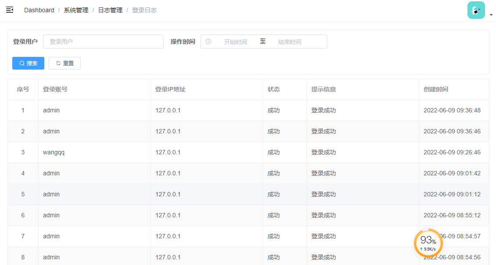
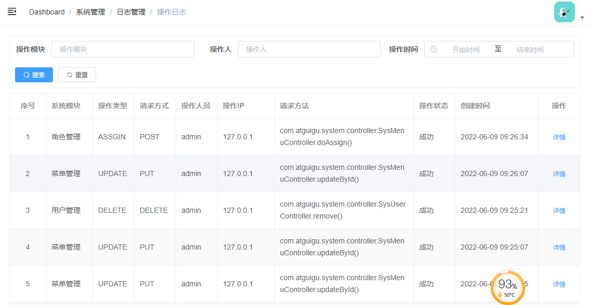

# 硅谷通用权限系统：日志管理

## 一、登录日志

在spring-security模块TokenLoginFilter登录成功方法里面记录登录日志

### 页面效果：



### 1、查询登录日志

#### 1.1 创建Mapper接口

在service-system模块中创建SysLoginLogMapper接口

```java
@Repository
public interface SysLoginLogMapper extends BaseMapper<SysLoginLog> {

    IPage<SysLoginLog> findPage(Page<SysLoginLog> page, @Param("vo") SysLoginLogQueryVo sysLoginLogQueryVo);

}
```

#### 1.2 创建Mapper映射文件

```xml
<?xml version="1.0" encoding="UTF-8" ?>
<!DOCTYPE mapper
        PUBLIC "-//mybatis.org//DTD Mapper 3.0//EN"
        "http://mybatis.org/dtd/mybatis-3-mapper.dtd">

<mapper namespace="com.atguigu.system.mapper.SysLoginLogMapper">

    <!--分页及带条件查询的方法-->
    <select id="findPage" resultType="sysLoginLog">
        select id, username, ipaddr, status, msg, access_time, create_time, update_time, is_deleted
        from `guigu-auth`.sys_login_log
        <where>
            <if test="vo.username != null and vo.username != ''">
                username = #{vo.username}
            </if>
            <if test="vo.createTimeBegin != null">
               and create_time >= #{vo.createTimeBegin}
            </if>
            <if test="vo.createTimeEnd != null">
               and create_time &lt;= #{vo.createTimeEnd}
            </if>
            and is_deleted = 0
        </where>
        order by id desc
    </select>
</mapper>
```

#### 1.3 创建SysLoginLogService接口

```java
public interface SysLoginLogService extends IService<SysLoginLog> {

    IPage<SysLoginLog> findPage(Page<SysLoginLog> pageParam, SysLoginLogQueryVo sysLoginLogQueryVo);
}
```

#### 1.4 创建SysLoginLogService接口实现类

```java
@Service
@Transactional
public class SysLoginLogServiceImpl extends ServiceImpl<SysLoginLogMapper, SysLoginLog> implements SysLoginLogService {

	@Resource
	private SysLoginLogMapper sysLoginLogMapper;

	@Override
	public IPage<SysLoginLog> findPage(Page<SysLoginLog> pageParam, SysLoginLogQueryVo sysLoginLogQueryVo) {

		return sysLoginLogMapper.findPage(pageParam, sysLoginLogQueryVo);
	}

}
```

#### 1.5 创建SysLoginLogController

```java
@Api(tags = "登录日志管理")
@RestController
@RequestMapping(value="/admin/system/sysLoginLog")
public class SysLoginLogController {
	
	@Autowired
	private SysLoginLogService sysLoginLogService;

	@ApiOperation(value = "获取分页列表")
	@GetMapping("{page}/{limit}")
	public Result index(
		@ApiParam(name = "page", value = "当前页码", required = true)
		@PathVariable Long page,
	
		@ApiParam(name = "limit", value = "每页记录数", required = true)
		@PathVariable Long limit,
	
		@ApiParam(name = "sysLoginLogVo", value = "查询对象", required = false)
                SysLoginLogQueryVo sysLoginLogQueryVo) {
		Page<SysLoginLog> pageParam = new Page<>(page, limit);
		IPage<SysLoginLog> pageModel = sysLoginLogService.findPage(pageParam, sysLoginLogQueryVo);
		return Result.ok(pageModel);
	}

}
```

### 2、添加登录日志

#### 2.1 创建LoginLogService接口

在spring-security模块创建LoginLogService接口

```java
package com.atguigu.system.service;

public interface LoginLogService {

    //记录日志
    void recordLoginLog(String username, String ipAddr , Integer status , String msg);
}
```

#### 2.2 创建LoginLogServiceImpl

在service-system模块创建LoginLogServiceImpl实现类

```java
package com.atguigu.system.service.impl;

import com.atguigu.model.system.SysLoginLog;
import com.atguigu.system.mapper.SysLoginLogMapper;
import com.atguigu.system.service.LoginLogService;
import org.springframework.beans.factory.annotation.Autowired;
import org.springframework.stereotype.Service;
import org.springframework.transaction.annotation.Transactional;

@Service
@Transactional
public class LoginLogServiceImpl implements LoginLogService {

    @Autowired
    private SysLoginLogMapper sysLoginLogMapper;

    @Override
    public void recordLoginLog(String username, String ipAddr, Integer status, String msg) {
        //创建SysLoginLog对象
        SysLoginLog sysLoginLog = new SysLoginLog();
        sysLoginLog.setUsername(username);
        sysLoginLog.setIpaddr(ipAddr);
        sysLoginLog.setStatus(status);
        sysLoginLog.setMsg(msg);
        sysLoginLogMapper.insert(sysLoginLog);
    }
}
```

#### 2.3 修改TokenLoginFilter

修改构造器

```java
/**
 * 认证成功生成Token的过滤器
 */
public class TokenLoginFilter extends UsernamePasswordAuthenticationFilter {

    private RedisTemplate redisTemplate;

    private LoginLogService loginLogService;

    public TokenLoginFilter(AuthenticationManager authenticationManager, RedisTemplate redisTemplate , LoginLogService loginLogService) {
        //设置认证管理器
        this.setAuthenticationManager(authenticationManager);
        //设置登录的地址和请求方式
        this.setRequiresAuthenticationRequestMatcher(new AntPathRequestMatcher("/admin/system/index/login", "POST"));
        this.redisTemplate = redisTemplate;
        this.loginLogService = loginLogService;
    }
```

修改认证成功的方法

```java
//认证成功调用的方法
    @Override
    protected void successfulAuthentication(HttpServletRequest request, HttpServletResponse response, FilterChain chain, Authentication authResult) throws IOException, ServletException {
        //通过Authentication获取认证的对象
        CustomUser customUser = (CustomUser) authResult.getPrincipal();
        //通过JwtHelper生成token
        String token = JwtHelper.createToken(customUser.getSysUser().getId(), customUser.getSysUser().getUsername());
        //获取用户的权限
        Collection<GrantedAuthority> authorities = customUser.getAuthorities();
        //将权限保存到Redis中
        redisTemplate.boundValueOps(customUser.getUsername()).set(authorities);

        //保存登录日志
        loginLogService.recordLoginLog(customUser.getUsername(), IpUtil.getIpAddress(request),1,"登录成功");

        //创建一个Map
        Map<String, Object> map = new HashMap<>();
        map.put("token", token);
        //通过ResponseUtil工具类响应到前端
        ResponseUtil.out(response, Result.ok(map));
    }
```

#### 2.4 修WebSecurityConfig配置类的方法

```java
@Autowired
private LoginLogService loginLogService;

 @Override
    protected void configure(HttpSecurity http) throws Exception {
        //关闭csrf功能
        http.csrf().disable();
        //设置那些请求不需要认证，那些请求需要认证
        http.authorizeRequests().antMatchers("/admin/system/index/login").permitAll().anyRequest().authenticated();
        //设置TokenAuthenticationFilter过滤器在UsernamePasswordAuthenticationFilter之前执行
        http.addFilterBefore(new TokenAuthenticationFilter(redisTemplate), UsernamePasswordAuthenticationFilter.class);
        //添加认证生成Token的过滤器
        http.addFilter(new TokenLoginFilter(authenticationManager(),redisTemplate,loginLogService));
        //禁用Session
        http.sessionManagement().sessionCreationPolicy(SessionCreationPolicy.STATELESS);
    }
```


## 2、操作日志

### 页面效果：



### 1、查询操作日志

#### 1.1 创建SysOperLogMapper接口

```java
@Repository
public interface SysOperLogMapper extends BaseMapper<SysOperLog> {

    IPage<SysOperLog> findPage(Page<SysOperLog> page, @Param("vo") SysOperLogQueryVo sysOperLogQueryVo);

}
```

#### 1.2 创建SysOperLogMapper映射文件

```xml
<?xml version="1.0" encoding="UTF-8" ?>
<!DOCTYPE mapper
        PUBLIC "-//mybatis.org//DTD Mapper 3.0//EN"
        "http://mybatis.org/dtd/mybatis-3-mapper.dtd">

<mapper namespace="com.atguigu.system.mapper.SysOperLogMapper">

    <select id="findPage" resultType="sysOperLog">
        select id, title, business_type, method, request_method, operator_type, oper_name, dept_name, oper_url, oper_ip, oper_param, json_result, status, error_msg, oper_time, create_time, update_time, is_deleted
        from `guigu-auth`.sys_oper_log
        <where>
            <if test="vo.title != null and vo.title != ''">
                and title like CONCAT('%',#{vo.title},'%')
            </if>
            <if test="vo.operName != null and vo.operName != ''">
                and oper_name like CONCAT('%',#{vo.operName},'%')
            </if>
            <if test="vo.createTimeBegin != null and vo.createTimeBegin != ''">
                and create_time >= #{vo.createTimeBegin}
            </if>
            <if test="vo.createTimeEnd != null and vo.createTimeEnd != ''">
                and create_time &lt;= #{vo.createTimeEnd}
            </if>
            and is_deleted = 0
        </where>
        order by id desc
    </select>
</mapper>
```

#### 1.3 创建SysOperLogService接口

```java
public interface SysOperLogService extends IService<SysOperLog> {

    IPage<SysOperLog> findPage(Page<SysOperLog> pageParam, SysOperLogQueryVo sysOperLogQueryVo);
}
```

#### 1.4 创建SysOperLogServiceImpl实现类

```java
@Service
@Transactional
public class SysOperLogServiceImpl extends ServiceImpl<SysOperLogMapper, SysOperLog> implements SysOperLogService {

	@Resource
	private SysOperLogMapper sysOperLogMapper;

	@Override
	public IPage<SysOperLog> findPage(Page<SysOperLog> pageParam, SysOperLogQueryVo sysOperLogQueryVo) {
		return sysOperLogMapper.findPage(pageParam, sysOperLogQueryVo);
	}
}
```

#### 1.5 创建SysOperLogController

```java
@Api(tags = "操作日志管理")
@RestController
@RequestMapping(value="/admin/system/sysOperLog")
public class SysOperLogController {
	
	@Resource
	private SysOperLogService sysOperLogService;

	@ApiOperation(value = "获取分页列表")
	@GetMapping("{page}/{limit}")
	public Result index(
		@ApiParam(name = "page", value = "当前页码", required = true)
		@PathVariable Long page,
	
		@ApiParam(name = "limit", value = "每页记录数", required = true)
		@PathVariable Long limit,
	
		@ApiParam(name = "sysOperLogVo", value = "查询对象", required = false)
				SysOperLogQueryVo sysOperLogQueryVo) {
		Page<SysOperLog> pageParam = new Page<>(page, limit);
		IPage<SysOperLog> pageModel = sysOperLogService.findPage(pageParam, sysOperLogQueryVo);
		return Result.ok(pageModel);
	}

	@ApiOperation(value = "获取详情")
	@GetMapping("/getById/{id}")
	public Result get(@PathVariable Long id) {
		SysOperLog sysOperLog = sysOperLogService.getById(id);
		return Result.ok(sysOperLog);
	}

}
```

### 2、添加操作日志

#### 2.1 创建common-log模块，导入以下依赖

```xml
<?xml version="1.0" encoding="UTF-8"?>
<project xmlns:xsi="http://www.w3.org/2001/XMLSchema-instance"
         xmlns="http://maven.apache.org/POM/4.0.0"
         xsi:schemaLocation="http://maven.apache.org/POM/4.0.0 http://maven.apache.org/xsd/maven-4.0.0.xsd">
    <parent>
        <artifactId>common</artifactId>
        <groupId>com.atguigu</groupId>
        <version>1.0</version>
    </parent>
    <modelVersion>4.0.0</modelVersion>
    
    <artifactId>common-log</artifactId>
	
    <dependencies>
        <dependency>
            <groupId>com.atguigu</groupId>
            <artifactId>model</artifactId>
            <version>1.0</version>
        </dependency>
        <dependency>
            <groupId>com.atguigu</groupId>
            <artifactId>common-util</artifactId>
            <version>1.0</version>
        </dependency>
        <dependency>
            <groupId>org.springframework.boot</groupId>
            <artifactId>spring-boot-starter-web</artifactId>
            <scope>provided</scope>
        </dependency>
        <dependency>
            <groupId>org.springframework.boot</groupId>
            <artifactId>spring-boot-starter-aop</artifactId>
        </dependency>
    </dependencies>
</project>
```

#### 2.2 创建枚举类

业务操作类型BusinessType

```java
package com.atguigu.system.enums;

/**
 * 业务操作类型
 */
public enum BusinessType {

    /**
     * 其他类型
     */
    OTHER,

    /**
     * 新增
     */
    INSERT,

    /**
     * 修改
     */
    UPDATE,

    /**
     * 删除
     */
    DELETE,

    /**
     * 更新状态
     */
    STATUS,

    /**
     * 授权
     */
    ASSIGN

}
```

操作人类型OperatorType

```java
package com.atguigu.system.enums;

/**
 * 操作人类型
 */
public enum OperatorType {

    /**
     * 其它
     */
    OTHER,

    /**
     * 后台用户
     */
    MANAGE,

    /**
     * 手机端用户
     */
    MOBILE
}
```

#### 2.3 创建注解类Log

```java
package com.atguigu.system.annotation;

import com.atguigu.system.enums.BusinessType;
import com.atguigu.system.enums.OperatorType;

import java.lang.annotation.*;

/**
 * 自定义操作日志记录注解
 */
@Target({ElementType.PARAMETER,ElementType.METHOD})
@Retention(RetentionPolicy.RUNTIME)
@Documented
public @interface Log {
    /**
     * 模块名称
     */
    String title() default "";

    /**
     * 业务操作类型
     */
    BusinessType businessType() default BusinessType.OTHER;

    /**
     * 操作人类别
     */
    OperatorType operatorType() default OperatorType.MANAGE;

    /**
     * 是否保存请求参数
     */
    boolean isSaveRequestData() default false;

    /**
     * 是否保存响应数据
     */
    boolean isSaveResponseData() default true;
}
```

#### 2.4 创建保存操作日志的接口OperLogService

在common-log模块创建OperLogService接口

```java
package com.atguigu.system.service;

import com.atguigu.model.system.SysOperLog;

/**
 * 保存操作日志的接口
 */
public interface OperLogService {
    /**
     * 保存操作日志
     * @param sysOperLog
     */
    void saveSysOperLog(SysOperLog sysOperLog);
}

```

#### 2.5 创建OperLogServiceImpl实现类

在servcie-system模块的pom.xml中添加以下依赖

```xml
 <!--依赖操作日志模块-->
 <dependency>
     <groupId>com.atguigu</groupId>
     <artifactId>common-log</artifactId>
     <version>1.0</version>
 </dependency>
```

在servcie-system模块创建实现类OperLogServiceImpl

```java
package com.atguigu.system.service.impl;

import com.atguigu.model.system.SysOperLog;
import com.atguigu.system.mapper.SysOperLogMapper;
import com.atguigu.system.service.OperLogService;
import org.springframework.beans.factory.annotation.Autowired;
import org.springframework.stereotype.Service;
import org.springframework.transaction.annotation.Transactional;

@Service
@Transactional
public class OperLogServiceImpl implements OperLogService {

    @Autowired
    private SysOperLogMapper sysOperLogMapper;

    @Async //异步调用该方法，会重开一个线程执行
    @Override
    public void saveSysOperLog(SysOperLog sysOperLog) {
        sysOperLogMapper.insert(sysOperLog);
    }
}
```

#### 2.6 创建LogAspect切面

在common-log模块创建

```java
package com.atguigu.system.aspect;

import com.alibaba.fastjson.JSON;
import com.atguigu.common.helper.JwtHelper;
import com.atguigu.common.util.IpUtil;
import com.atguigu.model.system.SysOperLog;
import com.atguigu.system.annotation.Log;
import com.atguigu.system.service.OperLogService;
import org.aspectj.lang.JoinPoint;
import org.aspectj.lang.annotation.AfterReturning;
import org.aspectj.lang.annotation.AfterThrowing;
import org.aspectj.lang.annotation.Aspect;
import org.springframework.beans.factory.annotation.Autowired;
import org.springframework.http.HttpMethod;
import org.springframework.stereotype.Component;
import org.springframework.util.StringUtils;
import org.springframework.validation.BindingResult;
import org.springframework.web.context.request.RequestAttributes;
import org.springframework.web.context.request.RequestContextHolder;
import org.springframework.web.context.request.ServletRequestAttributes;
import org.springframework.web.multipart.MultipartFile;

import javax.servlet.http.HttpServletRequest;
import javax.servlet.http.HttpServletResponse;
import java.util.Collection;
import java.util.Map;


/**
 * 日志切面
 */
@Aspect
@Component
public class LogAspect {

    @Autowired
    private OperLogService operLogService;

    /**
     * 返回通知
     * @param joinPoint 切点
     */
    @AfterReturning(pointcut = "@annotation(controllerLog)", returning = "jsonResult")
    public void doAfterReturning(JoinPoint joinPoint, Log controllerLog, Object jsonResult) {
        //调用处理日志的方法
        handleLog(joinPoint, controllerLog, null, jsonResult);
    }

    /**
     * 异常通知
     * @param joinPoint 切点
     * @param e         异常
     */
    @AfterThrowing(pointcut = "@annotation(controllerLog)", throwing = "e")
    public void doAfterThrowing(JoinPoint joinPoint, Log controllerLog, Exception e) {
        handleLog(joinPoint, controllerLog, e, null);
    }

    /**
     * 处理日志的方法
     * @param joinPoint
     * @param controllerLog
     * @param e
     * @param jsonResult
     */
    private void handleLog(JoinPoint joinPoint, Log controllerLog, Exception e, Object jsonResult) {
        try {
            //获取HttpServletRequst对象
            RequestAttributes requestAttributes = RequestContextHolder.getRequestAttributes();
            ServletRequestAttributes servletRequestAttributes = (ServletRequestAttributes) requestAttributes;
            HttpServletRequest request = servletRequestAttributes.getRequest();

            //创建SysOperLog对象
            SysOperLog sysOperLog = new SysOperLog();
            //设置状态为正常
            sysOperLog.setStatus(1);
            if (e != null) {
                //设置状态为异常
                sysOperLog.setStatus(0);
                //设置错误消息
                sysOperLog.setErrorMsg(e.getMessage());
            }
            //获取ip地址
            String ipAddress = IpUtil.getIpAddress(request);
            //设置ip地址
            sysOperLog.setOperIp(ipAddress);
            //设置请求地址
            sysOperLog.setOperUrl(request.getRequestURI());
            //获取token
            String token = request.getHeader("token");
            //获取用户名
            String username = JwtHelper.getUsername(token);
            //设置操作人员
            sysOperLog.setOperName(username);
			//设置请求方式
            sysOperLog.setRequestMethod(request.getMethod());
            
            //获取类名
            String className = joinPoint.getTarget().getClass().getName();
            //获取方法名
            String methodName = joinPoint.getSignature().getName();
            //设置方法名称
            sysOperLog.setMethod(className+"."+methodName+"()");
            

            //设置操作模块
            sysOperLog.setTitle(controllerLog.title());
            //设置业务类型
            sysOperLog.setBusinessType(controllerLog.businessType().name());
            //设置操作人类别
            sysOperLog.setOperatorType(controllerLog.operatorType().name());
            //判断是否需要保存请求数据
            if(controllerLog.isSaveRequestData()){
                //调用设置请求数据的方法
                setRequestData(joinPoint,sysOperLog);
            }
            //判断是否需要保存响应数据
            if(controllerLog.isSaveResponseData() && !StringUtils.isEmpty(jsonResult)){
                //设置响应数据
                sysOperLog.setJsonResult(JSON.toJSONString(jsonResult));
            }

            //保存操作日志
            operLogService.saveSysOperLog(sysOperLog);
        } catch (Exception ex) {
            ex.printStackTrace();
        }
    }

    /**
     * 设置请求数据的方法
     * @param joinPoint
     * @param sysOperLog
     */
    private void setRequestData(JoinPoint joinPoint, SysOperLog sysOperLog) {
        String requestMethod = sysOperLog.getRequestMethod();
        if (HttpMethod.PUT.name().equals(requestMethod) || HttpMethod.POST.name().equals(requestMethod)) {
            String params = argsArrayToString(joinPoint.getArgs());
            sysOperLog.setOperParam(params);
        }
    }

    /**
     * 参数拼装的方法
     */
    private String argsArrayToString(Object[] paramsArray) {
        String params = "";
        if (paramsArray != null && paramsArray.length > 0) {
            for (Object o : paramsArray) {
                if (!StringUtils.isEmpty(o) && !isFilterObject(o)) {
                    try {
                        Object jsonObj = JSON.toJSON(o);
                        params += jsonObj.toString() + " ";
                    } catch (Exception e) {
                    }
                }
            }
        }
        return params.trim();
    }

    /**
     * 判断是否需要过滤的对象。
     * @param o 对象信息。
     * @return 如果是需要过滤的对象，则返回true；否则返回false。
     */
    public boolean isFilterObject(final Object o) {
        Class<?> clazz = o.getClass();
        if (clazz.isArray()) {
            return clazz.getComponentType().isAssignableFrom(MultipartFile.class);
        } else if (Collection.class.isAssignableFrom(clazz)) {
            Collection collection = (Collection) o;
            for (Object value : collection) {
                return value instanceof MultipartFile;
            }
        } else if (Map.class.isAssignableFrom(clazz)) {
            Map map = (Map) o;
            for (Object value : map.entrySet()) {
                Map.Entry entry = (Map.Entry) value;
                return entry.getValue() instanceof MultipartFile;
            }
        }
        return o instanceof MultipartFile || o instanceof HttpServletRequest || o instanceof HttpServletResponse
                || o instanceof BindingResult;
    }

}
```


#### 2.7 在Controller中添加@Log注解

以角色管理为例，使用自定义标签记录日志

```java
@Log(title = "角色管理",businessType = BusinessType.INSERT)
@ApiOperation("添加角色")
@PostMapping("/save")
public Result save(@RequestBody SysRole sysRole){
    //调用SysRoleService中添加的方法
    sysRoleService.save(sysRole);
    return Result.ok();
}

@Log(title = "角色管理",businessType = BusinessType.UPDATE)
@ApiOperation("更新角色信息")
@PutMapping("/update")
public Result update(@RequestBody SysRole sysRole){
    //调用SysRoleService中更新的方法
    sysRoleService.updateById(sysRole);
    return Result.ok();
}

@Log(title = "角色管理",businessType = BusinessType.DELETE)
@ApiOperation("根据Id删除角色")
@DeleteMapping("/remove/{id}")
public Result delete(@PathVariable Long id){
    //调用SysRoleService中删除的方法
    sysRoleService.removeById(id);
    return Result.ok();
}

//根据id批量删除角色的方法
@Log(title = "角色管理",businessType = BusinessType.DELETE)
@ApiOperation("批量删除角色")
@DeleteMapping("/batchRemove")
public Result batchRemove(@RequestBody List<Long> ids){
    //调用SysRoleService中批量删除的方法
    sysRoleService.removeByIds(ids);
    return Result.ok();
}

@Log(title = "角色管理",businessType = BusinessType.ASSIGN)
@ApiOperation("分配角色")
@PostMapping("/assignRoles")
public Result assignRoles(@RequestBody AssignRoleVo assignRoleVo){
    //调用SysRoleService中分配角色的方法
    sysRoleService.assignRoles(assignRoleVo);
    return Result.ok();
}
```

### 3、微服务改进

LogAspect类

```java
//微服务切换为feign调用接口
@Autowired
private OperLogService operLogService;
```

operLogService保存日志需替换为feign调用接口